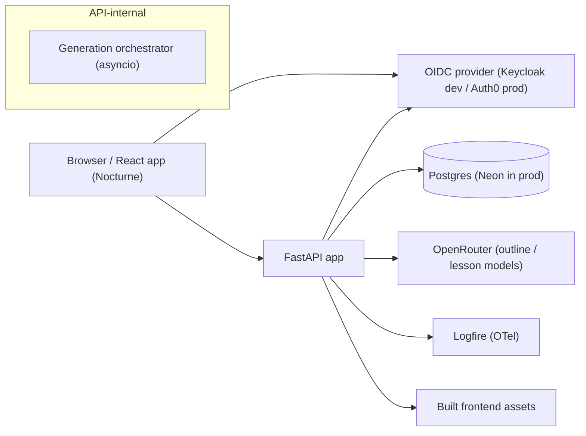

# TDD — Phase 1: The generated path (MVP)

**Status:** Draft · **Owner:** solo builder · **Companion to:** [Phase 1 PRD](../prds/phase-1-path-generation.md)
**References:** [`roadmap.md`](../roadmap.md) · [`CONTEXT.md`](../CONTEXT.md) · mocks: [web](../mocks/aleph-mvp-web.html), [mobile](../mocks/aleph-mvp-mobile.html)
**Pattern sources:** [`mattjmcnaughton/templates`](https://github.com/mattjmcnaughton/templates) (scaffold) · [`mattjmcnaughton/habagou`](https://github.com/mattjmcnaughton/habagou) (reference implementation)

> The PRD owns the product boundary. This TDD owns everything the PRD delegated: stack and
> scaffolding, storage schema, model routing, prompts and context-carrying, prefetch mechanics,
> failure semantics, hosting, instrumentation, and how the E2E workflows and evals actually run.

## 1. Decision record

Decisions made drafting this TDD, so the rationale isn't re-litigated later:

| # | Decision | Choice | Why |
| --- | --- | --- | --- |
| D1 | Stack | `python-web` template + composed `frontend-react` (FastAPI, async SQLAlchemy/Postgres, Vite React) | Maximum reuse of habagou's proven patterns (agents, auth, evals, deploy) |
| D2 | Auth | Habagou's OIDC pattern: Keycloak (dev/CI) + Auth0 (prod), signed session cookie | Proven, provider-agnostic, deterministic local dev |
| D3 | Hosting | Fly.io + Neon Postgres, semantic-release CD | Habagou's runbook transfers nearly verbatim |
| D4 | LLM access | OpenRouter via pydantic-ai, agents bind no model | Habagou's seam; per-role routing is config |
| D5 | Content delivery | Trigger + poll (no blocking calls, no streaming in MVP) | Robust across timeouts/restarts; same machinery serves prefetch; trivially testable |
| D6 | Prefetch orchestration | In-process asyncio + DB state machine with stale-recovery, plus an in-process reconciler loop | No new infra; restart self-heals via state timeouts; reconciler removes the "work needs a poller" constraint |
| D7 | Continuity context | Full prior Read-passage text in the prompt, windowed to the most recent `CONTINUITY_PASSAGES_MAX` | ≤ ~20k tokens per lesson, bounded by the window (not by path length — `MAX_LESSONS_PER_PATH` no longer bounds this); zero extra machinery. Revisit (summary/RAG) only if cost data demands |
| D8 | Model routing | Three config slots: `outline`, `lesson`, `judge` | Structure quality is unrecoverable (no regenerate) → stronger outline model; lessons cheaper/faster |
| D9 | E2E strategy | Deterministic stub model in CI; opt-in live smoke (`test-external`) | PRD §8 open question resolved; failure/refusal paths become forceable |
| D10 | Evals | pydantic-evals + deterministic pre-filters + binary LLM judge | Habagou harness shape, extended with the judge the PRD requires |
| D11 | Instrumentation | Logfire (OTel) for everything — product events and ops guardrails | One system; SQL over spans covers §7 metrics. No Postgres events table for now (see §9 risk) |
| D12 | Refusal signaling | Structured output union (`outline \| refusal`) | Refusal is a first-class result, never conflated with failure (W7) |
| D13 | Cost protection | Per-account daily caps on path creation and lesson generation | Cheap insurance on the §7 cost guardrail; habagou `rate_limit` pattern |
| D14 | Admin | Derived admin (`ADMIN_EMAIL_DOMAINS`) + model picker over an allowlist | Compare models on real paths without redeploying; habagou pattern |
| D15 | Client | Responsive mobile-first web app (no native client) | Matches mocks and Nocturne; habagou serving model |

## 2. Scaffolding & reuse

This section is explicit about where every piece comes from: **scaffolded** from
`mattjmcnaughton/templates`, **copied/adapted** from habagou, or **built new** for Aleph.

### 2.1 Scaffold from templates

Scaffold into this existing repo (docs already live here) with
[Copier](https://copier.readthedocs.io/), using the `python-web` template and composing
`frontend-react` into it, exactly as habagou was built:

```sh
# from the aleph repo root
uvx copier copy --trust gh:mattjmcnaughton/templates aleph \
  # answers below; python-web lives at templates/python-web in the monorepo
uvx copier copy --trust path/to/templates/templates/frontend-react \
  src/aleph/web/frontend   # answer is_composed=true
```

Copier answers:

| Question | Answer | Note |
| --- | --- | --- |
| `project_name` | `aleph` | package `aleph` |
| `project_description` | Mobile-friendly AI tutor: name a topic, get a generated learning path | |
| `license` | MIT | |
| `include_database` | **true**, `database_type=postgres` | async SQLAlchemy + Alembic |
| `include_clients` | false | OpenRouter seam lives in `services/` (habagou convention) |
| `enable_otel` | **true** | `telemetry.py` then adapted to `logfire.configure()` (§9) |
| `include_technical_docs` / `include_product_docs` | false / false | Aleph keeps its existing `docs/prds/` + `docs/tdds/` layout |
| frontend `is_composed` | true | composes into `src/aleph/web/frontend/` |

The scaffold provides: src layout (`app.py`, `config.py`, `logging.py`, `telemetry.py`,
`db.py`, `routers/health.py`, `services/`, `dtos/`, `repositories/`, `models/`,
`web/serve.py`), Alembic, the full justfile target set (`fmt`/`lint`/`typecheck`/`test-*`
/`gate*` with `-be`/`-fe` variants), GitHub Actions CI, Dockerfile, docker-compose,
`.env.example`, CLAUDE.md/AGENTS.md.

### 2.2 Copy / adapt from habagou

Not in the template; habagou is the reference implementation. Copy and adapt (rename,
trim habagou-specifics), keeping habagou's layering rules intact:

| Concern | Habagou source | Adaptation |
| --- | --- | --- |
| OIDC auth (login/callback/logout, identity mapping, session cookie) | `src/habagou/auth.py`, `dependencies.py`, `docs/auth.md` | Near-verbatim; `(issuer, subject)` identity key; verified-email guard |
| Keycloak dev realm + compose services | realm template, `docker-compose`, `just compose-db-up` | Rename realm/client to aleph |
| Derived admin + model allowlist enforcement | `habagou.authz.is_admin`, session/status endpoints, 403/422 enforcement | Picker covers `outline`/`lesson` slots (§5.3) |
| OpenRouter model resolution seam | `services/openrouter.py` | Verbatim pattern |
| Agent layer conventions (no bound model, no config/db, deps protocols) | `agents/` + `docs/architecture.md`, ADRs 0010/0011 | New agents, same purity rules (§5.1) |
| Rate limiting | `services/rate_limit.py` | Caps from §14 |
| Evals harness shape (dev-only group, CLI, opt-in workflow) | `evals/`, `.github/workflows/evals.yml`, `docs/evals.md` | Extend with LLM judge (§11) |
| Live smoke tests | `tests/external/`, `just test-external` | One real outline + one real lesson round trip |
| Fly + Neon deploy, semantic-release CD | `docs/deploy.md`, `fly.toml`, `.releaserc.json`, release workflow | App `aleph-prod-mattjmcnaughton`; same Neon URL rewriting, `release_command` migrations |
| Conventional-commit release policy | habagou CLAUDE.md | Same table |

### 2.3 Build new for Aleph

The actual product: domain models and schema (§4), outline/lesson agents and prompts (§5.1),
generation orchestrator with prefetch and stale-recovery (§5.4), trigger+poll API (§6),
deterministic Quick-check grading, the stub model for CI/e2e (§12), judge evaluator and
seed set (§11), and all Nocturne frontend surfaces (§8).

### 2.4 CLAUDE.md / AGENTS.md — progressive disclosure

The scaffold generates a CLAUDE.md (AGENTS.md symlinked); invest in it deliberately.
Structure it for **progressive disclosure**, matching habagou's shape: a short root file
carrying only what every task needs — the just-command table, the layering rules
(routers → services → (agents, repositories); agents bind no model, import no
config/db), commit conventions, and test organization — with pointers into `docs/`
(this TDD, the PRD, CONTEXT.md, architecture/development docs) that an agent reads
on demand rather than front-loading. Keep CONTEXT.md the vocabulary authority and
link it prominently: same word, same meaning, in prompts and code alike.

## 3. Architecture overview



Layering follows habagou exactly: `routers → services → (agents, repositories)`.
Agent definitions in `agents/` import no services, routers, config, or DB. Pure
domain logic (unlock derivation, grading) lives in `domains/`.

```
src/aleph/
  app.py  config.py  logging.py  telemetry.py  db.py  auth.py  dependencies.py  authz.py
  domains/
    progression.py      # pure: unlock-state derivation, next-lesson, completion rollup
    grading.py          # pure: deterministic Attempt → Outcome
  agents/
    outline.py          # outline agent: topic+level → PathOutline | Refusal
    lesson.py           # lesson agent: outline ctx + prior lessons → LessonContent
  routers/
    health.py
    v1/  auth.py  paths.py  lessons.py
  services/
    path_service.py  lesson_service.py  generation.py (orchestrator)
    openrouter.py  rate_limit.py
  repositories/  models/  dtos/
  web/serve.py  web/frontend/
evals/                  # dev-only, never packaged (§11)
tests/  unit/  integration/  e2e/  external/
```

## 4. Data model & storage schema

Implements the PRD's `account → paths → units → lessons → quick checks` with
CONTEXT.md's two orthogonal lesson axes. **Unlock state is derived, never stored**
(from `completed_at` + linearity); **generation state is stored** (it's system work
that must survive restarts).

**Every table** carries `id uuid PK`, `created_at timestamptz`, and `updated_at timestamptz`
(server defaults; `updated_at` maintained via SQLAlchemy `onupdate`). Those columns are
omitted below for brevity. All external references — API routes and DTOs — use the UUID;
no serial ids, no slugs.

```
users          issuer · subject · username · display_name · email
               (UNIQUE (issuer, subject) — habagou identity model)

paths          user_id FK→users ON DELETE CASCADE · topic text ·
               level enum(new_to_it | some_experience | work_in_it) ·
               status enum(pending | generating | ready | failed | refused) ·
               refusal_message text NULL · generation_started_at timestamptz NULL

units          path_id FK→paths ON DELETE CASCADE · position int ·
               title · summary text        (UNIQUE (path_id, position))

lessons        unit_id FK→units ON DELETE CASCADE ·
               path_id FK→paths (denormalized) · position_in_path int ·
               position_in_unit int · title ·
               generation_state enum(ungenerated | generating | generated | failed) ·
               generation_started_at timestamptz NULL · generation_error text NULL ·
               read_passage text NULL · generated_at NULL · completed_at NULL
               (UNIQUE (path_id, position_in_path))

quick_checks   lesson_id FK UNIQUE (1:1) · stem ·
               options jsonb (array of 3–4 strings) · correct_index int · explanation

attempts       quick_check_id FK · user_id FK (denormalized for metrics) ·
               selected_index int · is_correct bool
               (UNIQUE (quick_check_id, user_id) — one Attempt per learner per Quick check)
```

- `position_in_path` is the **total order** that continuity and prefetch operate on;
  `unit.position` + `position_in_unit` are for display.
- **Delete path** = hard `DELETE` on `paths`; cascades take units/lessons/quick checks/attempts.
  Confirmed in UI; not undoable (PRD §5.5). Analytics history survives in Logfire, not the DB.
- One Attempt per Quick check per learner: the first answer is the Outcome of record
  (activation counts it); after attempting, the lesson renders in revealed state.
- Derived unlock (in `domains/progression.py`): lesson is *complete* iff `completed_at`
  set; *available* iff it's the first incomplete lesson in `position_in_path` order;
  else *locked*.

**State machines.**

```
path.status:              pending → generating → ready
                                       ├→ failed   (retry → generating)
                                       └→ refused  (terminal; distinct UI, W7)
lesson.generation_state:  ungenerated → generating → generated   (terminal, content immutable)
                                            └→ failed            (retry → generating)
```

Stale recovery: a row in `generating` whose `generation_started_at` is older than
`GENERATION_STALE_AFTER` (3 min, §14) is treated as `failed` by readers and is
re-claimable — a machine restart mid-generation self-heals with no operator action.

## 5. Generation pipeline

### 5.1 Agents (pydantic-ai, habagou purity rules)

Two agents in `agents/`, each a complete pydantic-ai agent — system prompt, output type,
output validators — **binding no model** and importing no config/services/DB.

**Outline agent** (`agents/outline.py`)
- Input: topic, level.
- Output type (union — D12): `PathOutline | Refusal`.
  - `PathOutline`: `units: list[UnitOutline]` (title, summary, `lessons: list[LessonOutline]`
    (title)) — sized per §14 caps.
  - `Refusal`: `message: str` — the prompt instructs the model to use this branch for
    topics over the PRD §10 boundary (materially aids serious harm), and to phrase the
    message as a graceful, non-error explanation. Any genuine learning topic, including
    sensitive-but-legitimate ones, must not refuse.
- Output validators (`ModelRetry` on violation, habagou's layer-2 pattern): unit/lesson
  counts within caps, non-empty titles, no duplicate lesson titles.

**Lesson agent** (`agents/lesson.py`)
- Input: topic, level, full outline, this lesson's unit + title + `position_in_path`, and
  the **full Read passages of lessons `1…N`** in order (D7 continuity; see §5.2).
- Output type: `LessonContent`: `read_passage: str`, `quick_check: {stem, options (3–4),
  correct_index, explanation}`.
- Output validators: 3–4 options, `correct_index` in range, options non-duplicative,
  passage within size band (§14), stem/explanation non-empty. These same checks are the
  evals' deterministic pre-filters (§11) — shared code, not duplicated.
- No refusal branch: the topic was already admitted at outline time. A mid-path provider
  refusal surfaces as `failed` + retry; the eval safety rubric is the content backstop.

**Where safety lives — deliberately no `agents/safety.py`.** The safety boundary has
exactly three homes: (1) the outline agent's structured `Refusal` branch is the topic
gate and the only origin of a learner-facing refusal; (2) the judge's safety rubric item
(§11) is the generated-content backstop, a hard block on any failure; (3) the lesson
agent inherits an already-admitted topic and needs no gate of its own. A dedicated
safety agent would add a model call to every generation to re-perform a check the
outline already makes.

### 5.2 Continuity mechanics & token budget

Prompt for lesson N+1 carries prior **Read passages only** (not quick checks), verbatim, in
order, each prefixed by unit/lesson title — but only the most recent `CONTINUITY_PASSAGES_MAX`
(30, §14) of them, regardless of how far into the path lesson N+1 sits. This is a deliberate
bound, separate from `MAX_LESSONS_PER_PATH`: **per-lesson continuity input no longer grows
with path length.** Worst case, at or past the window, with ~500-word passages ≈
30 × ~650 tok ≈ **19k input tokens** for any one lesson — comfortably inside any candidate
model's context, and unchanged whether the path has 30 lessons or 200. Nothing is
structurally lost by windowing: the prompt already carries the full outline (unit + lesson
titles, `_load_outline`), so lessons older than the window are still *named*, they just stop
contributing full passage text.

Cumulative input cost per full path still grows with path length (more lessons, each paying
up to the ~19k-token window), just no longer quadratically once a path exceeds the window —
each lesson past position 31 costs the same ~19k input tokens as the one before it, not more.
For a maximal 200-lesson path: ≈ 3.6M input + ≈ 167k output tokens across all 200 lessons
(vs. ≈ 290k input + ≈ 25k output across 30 lessons at the old cap); on a Haiku-class lesson
model ($1/$5 per MTok) a worst-case fully-generated maximal path lands around **$4.50**
including the Sonnet outline (vs. ≈ $0.45 at the old 30-lesson cap — roughly 10×, not the
~30× a naive unwindowed extrapolation would suggest); the all-Sonnet starting config (§5.3)
runs ≈ 3× that. Still an edge case (most paths target ~5 units × 3–8 lessons, §5.1) and
tracked, not assumed (§9, §10). If real data pressures cost further, the upgrade path is a
running summary or retrieval (**explicitly deferred**, D7) — replacing the window with
something smarter, not removing it; the seam is a single `build_prior_context()` function in
`services/generation.py`.

Ordering invariant (PRD §5.2): lesson N+1 generates only when lessons 1…N are `generated`
— its context is complete and immutable (content never regenerates). The orchestrator
enforces this by construction (§5.4).

### 5.3 Model routing

Three config slots (env, with per-slot defaults): `MODEL_OUTLINE`, `MODEL_LESSON`,
`MODEL_JUDGE` — OpenRouter ids resolved through `services/openrouter.py`. **All three
default to `anthropic/claude-sonnet-5` to start** — one strong model everywhere, no
premature tiering; refine per-slot against eval results and cost data. The expected
refinement directions, when data justifies them:

| Slot | Starting default | Refinement direction |
| --- | --- | --- |
| `MODEL_OUTLINE` | `anthropic/claude-sonnet-5` | Stays strong: once per path, unrecoverable (no regenerate), gates everything downstream |
| `MODEL_LESSON` | `anthropic/claude-sonnet-5` | The high-volume slot (up to `MAX_LESSONS_PER_PATH` generations/path, each paying at most the flat `CONTINUITY_PASSAGES_MAX`-window continuity cost, §5.2) — step *down* (e.g. `anthropic/claude-haiku-4-5`) if evals hold and cost/latency favor it |
| `MODEL_JUDGE` | `anthropic/claude-sonnet-5` | Likely move **cross-provider** (e.g. `openai/gpt-5.6-terra`): LLM judges exhibit self-preference bias, and a Claude judge grading Claude-written lessons risks inflating the release-gate pass rate. Judge↔human calibration (§11) is the real control either way |

`MODEL_ALLOWLIST` defaults to `anthropic/claude-sonnet-5` plus the refinement candidates:
`anthropic/claude-haiku-4-5` (lessons down), `anthropic/claude-opus-4-8` (A/B up),
`openai/gpt-5.6-terra` (cross-provider judge), `minimax/minimax-m3` (A/B down).

`services/openrouter.py` is a thin factory, not a client — pydantic-ai's
`OpenRouterProvider` owns the protocol. The service owns what pydantic-ai can't:
building `OpenAIChatModel(id, provider=...)` from *our* config, caching built models so
each doesn't leak a fresh `httpx.AsyncClient` pool per request (habagou's documented
rationale), picker display labels, and resolving the `stub` id to the deterministic test
model (§12). It also preserves the layering rule: agents bind no model, so the binding
must live outside `agents/`. Admins (D14) can override outline/lesson per-request from the
`MODEL_ALLOWLIST`, enforced server-side (403 non-admin, 422 off-allowlist) — habagou's
picker pattern, used to A/B models on real paths without redeploying.

### 5.4 Orchestration: trigger + poll, in-process prefetch

**No queue, no worker process** (D5/D6). Generation runs as asyncio tasks inside the
FastAPI process, coordinated *only* through the DB state machine, so any instance (or a
restarted one) can pick up where another left off.

- **Claiming is atomic:** `UPDATE lessons SET generation_state='generating',
  generation_started_at=now() WHERE id=… AND (state='ungenerated' OR state='failed' OR
  (state='generating' AND generation_started_at < now() - stale)) RETURNING id` — the
  claim either wins or someone else is already on it. Same pattern for `paths.status`.
  Correct under multiple Fly machines even though MVP runs one.
- **Path creation:** `POST /paths` inserts the row (`pending`), spawns the outline task,
  returns `202` immediately. Outline task → claims → runs outline agent → on
  `PathOutline`: insert units/lessons (`ungenerated`), set `ready`, kick prefetch; on
  `Refusal`: set `refused` + message; on error/timeout: set `failed`.
- **Prefetch driver:** a single per-path async chain (never parallel within a path — the
  ordering invariant). `ensure_generated_through(path, k)` walks lessons in
  `position_in_path` order, claiming and generating each until position `k`. Called with
  `k = first_incomplete + PREFETCH_N` on: path becoming `ready`, lesson viewed, lesson
  completed, and explicit retry. Failure stops the chain (later lessons need the failed
  one's content); learner-facing retry restarts it.
- **The poll is also the trigger.** Path and lesson polls (`GET /paths/{uuid}`,
  `GET /lessons/{uuid}`, 2s interval with backoff, §14) don't just read state — each
  poll runs the same idempotent ensure-generation claim. This is the property that
  makes in-process orchestration safe: a background task lost to a crash or deploy
  costs at most one stale-timeout of extra wait before a routine poll re-claims and
  resumes, because the waiting learner *is* the retry loop. Nothing needs a durable
  queue to survive.
- **The reconciler.** A single asyncio loop, started in the FastAPI lifespan, that
  every `RECONCILER_INTERVAL` (30s, §14) scans for claimable work — stale-`generating`
  rows and paths whose prefetch window is unfilled — and runs the same
  `ensure_generated_through` driver through the same claims. Poll-as-trigger remains as
  a redundant second driver, but crashed chains now resume within one tick instead of
  waiting for a learner's poll, and work without an active poller (e.g. a future
  regenerate-after-prompt-change script that resets rows) drains automatically.
- **Global concurrency bound:** per-path work is inherently serialized, but nothing
  else caps aggregate load — 50 simultaneous path creations would mean 50 concurrent
  model calls. A process-wide `asyncio.Semaphore` (`MAX_CONCURRENT_GENERATIONS`, §14)
  wraps every model call, turning spend/latency spikes into a queue.
- **Graceful shutdown:** the FastAPI lifespan cancels in-flight generation tasks on
  shutdown; the state machine makes cancellation safe (rows revert via stale recovery),
  so no cleanup-on-cancel logic exists anywhere.

**Implementation invariants (where this pattern usually bites):**
- Spawned tasks never borrow the request's DB session — they open short-lived sessions
  from the factory per step (the request completes while the task runs for minutes).
- The orchestrator holds strong references to spawned tasks in a registry — a bare
  `asyncio.create_task()` whose reference is dropped can be garbage-collected mid-flight
  and swallows its exceptions. The registry is also what shutdown cancels.
- Every task body has a top-level handler that records `failed`; an escaped exception
  degrades to stale recovery (correct, but one stale-timeout late).
- `GENERATION_STALE_AFTER > GENERATION_TIMEOUT` + overhead is a tested invariant, not a
  comment — otherwise a healthy slow generation gets double-claimed.
- Prefetch auto-recovers *stale* rows (crashes) but never *failed* rows (real errors) —
  a systematically failing generation must not silently retry-burn spend; the learner's
  explicit retry is the loop.

**Alternatives considered & the upgrade ladder (D6 rationale).** FastAPI
`BackgroundTasks`: tied to the request lifecycle, no dedupe or observability — wrong
for multi-minute ordered chains. Redis queues (arq/Celery): real retry semantics, but
adds Redis to dev, CI, Compose, and Fly for jobs that are already idempotent and
re-driven from the DB — not the answer for this workload at any scale we foresee.
The real upgrade path stays on Postgres, and it's a ladder where every rung keeps the
state machine, claims, and API contract unchanged:

1. **In-process reconciler** — *included in MVP, above.*
2. **Dedicated worker process** — same codebase, a `worker` process group in
   `fly.toml` running the reconciler as its whole job; the web tier stops spawning
   tasks and polls become pure reads. Claim upgrades to `SELECT … FOR UPDATE SKIP
   LOCKED` (the canonical Postgres work-queue idiom) for clean worker pools. Trigger:
   generation load measurably affects request latency, or deploy-kills of in-flight
   work become a felt cost.
3. **Real queue semantics** — `attempts` + `next_attempt_at` columns for backoff
   retries, a dead-letter state, priorities. Build by hand while job *variety* stays
   this small (generation state is domain data, not queue bookkeeping); consider a
   Postgres-native library (e.g. procrastinate) only if job types multiply.

Each rung is additive — the reconciler becomes the worker body becomes the scheduler —
so choosing in-process today is a rung to climb from, not a bet to unwind.

### 5.5 Failure semantics (PRD §5.6 → mechanics)

| Failure | State result | Learner sees | Retry |
| --- | --- | --- | --- |
| Outline model error / timeout | `paths.status=failed` | Onboarding retains topic+level; clear error + retry CTA | `POST /paths/{id}/retry` re-claims |
| Outline refusal | `paths.status=refused` | Distinct graceful message (not an error) | No retry; new topic |
| Lesson model error / timeout | `generation_state=failed`, error recorded | Lesson view error + retry; rest of path, other paths untouched | `POST /lessons/{id}/generate` re-claims |
| Process restart mid-generation | Row stuck in `generating` | Nothing (window < stale timeout) | Stale-recovery auto re-claims on next trigger |

Per-call timeout `GENERATION_TIMEOUT` (§14) bounds every model call so `failed` is
always reached; no dead spinners (W8).

## 6. API design

Health unversioned (`/healthz`, `/readyz`); auth at `/auth/*` (habagou flow); resources
under `/api/v1`, session-cookie protected. **All resource routes address by UUID**
(`{id}` below is always the resource's UUID) — never serial ids, never slugs.

| Endpoint | Purpose |
| --- | --- |
| `GET /auth/login` · `GET /auth/callback` · `POST /auth/logout` | OIDC flow (habagou) |
| `GET /api/v1/auth/session` | Current user, `is_admin`, model allowlist (for picker) |
| `POST /api/v1/paths` `{topic, level}` | Create path, trigger outline → `202 {id}`; rate-limited |
| `GET /api/v1/paths` | Switcher list: topic, level, status, progress summary |
| `GET /api/v1/paths/{id}` | Poll target: status (+refusal message), outline, per-lesson generation/unlock state, progress |
| `POST /api/v1/paths/{id}/retry` | Retry failed outline |
| `DELETE /api/v1/paths/{id}` | Hard delete (UI confirms) |
| `GET /api/v1/lessons/{id}` | Poll target: generation state; when generated: read passage + quick check (stem+options only pre-Attempt; + outcome/correct/explanation after) |
| `POST /api/v1/lessons/{id}/generate` | Idempotent ensure/retry generation (also fires prefetch) |
| `POST /api/v1/lessons/{id}/attempt` `{selected_index}` | Record Attempt (first one wins), grade deterministically → outcome + correct option + explanation |
| `POST /api/v1/lessons/{id}/complete` | Mark complete (non-gating), advances prefetch window |

Correct answers are **not** sent to the client before an Attempt (the grading is
server-side; `GET` omits `correct_index`/`explanation` until an Attempt exists).
All endpoints enforce ownership (404 for other users' resources). Locked lessons
(unlock derivation) return their state but `403` on attempt/complete.

## 7. Auth

Habagou's design verbatim (see `habagou/docs/auth.md`): server-side authorization-code
flow; Keycloak realm (generated from a checked-in template) for dev/CI/browser tests;
Auth0 Regular Web Application in prod; signed `HttpOnly` `SameSite=Lax` cookie holding
only the local user UUID; `(issuer, subject)` as sole identity key; presentation claims
refreshed at login; `email_verified:false` → email dropped (protects derived admin).
Admin = email domain ∈ `ADMIN_EMAIL_DOMAINS` (default `mattjmcnaughton.com`), derived
not stored.

## 8. Frontend

Vite React app composed from `frontend-react` at `src/aleph/web/frontend/`, served by
FastAPI in prod (`web/serve.py`), Vite dev proxy locally. **Responsive, mobile-first,
Nocturne** — extend the mocks' dark/teal system; the mocks are the layout reference,
minus the non-Phase-1 surfaces (tutor rail, streaks, stats).

Surfaces (all Phase 1): onboarding (topic + level, generating state, refusal + error
states), path view (units/lessons rail with complete/current/locked, progress,
completion state), lesson view (Read passage → Quick check → outcome/explanation →
mark complete; generating + failed states), "Your paths" switcher (+ New path, delete
with confirm), auth screens, admin-only model picker. Client polling per §5.4; state
management stays simple (poll-driven server state, e.g. TanStack Query).

## 9. Instrumentation & observability (Logfire)

**Logfire is the single sink** (D11): `logfire.configure()` in `telemetry.py`, with
`logfire.instrument_fastapi()`, `instrument_pydantic_ai()` (token/cost per model call
captured automatically), and SQLAlchemy/httpx instrumentation. It's OTel under the hood,
matching the template's `enable_otel` seam.

**Application logging is structlog** — habagou's `logging.py` pattern verbatim
(contextvars merging, ISO timestamps, JSON renderer in prod / console in dev), with
Logfire attached to the structlog processor pipeline so log events carry their
structured fields into the same sink as spans. Workflow-tagged events (§12) include a
`workflow="W1"` field, giving one vocabulary from PRD → tests → production traces.

**Product events** (PRD §5.7) are structured Logfire events emitted from services —
`account_created`, `path_created`, `outline_generated` (success/failure/latency),
`lesson_generated` (ditto), `lesson_viewed`, `quick_check_attempted` (outcome),
`lesson_completed`, `path_completed`, `path_deleted` — each carrying `account_id`,
`path_id`, `lesson_id`, `position_in_path`, timestamps. §7 metrics (activation rate,
first-lesson activation, continuation, return, breadth) are **saved Logfire SQL queries**
over these events; the TDD ships the queries alongside the event emitters so §5.7's
"metrics are computable" is verified, not assumed. Ops guardrails (generation p95,
failure rate, cost per path) come from the same spans.

**Known risk (accepted):** Logfire's retention window bounds cohort history — long-window
metrics can't look back past retention, and analytics history doesn't survive path
deletion anywhere else. If retention becomes limiting, the fallback is the deferred
append-only Postgres events table (habagou `events.py` pattern); event emission is a
single seam so the swap is additive.

## 10. Cost controls & rate limiting

Per-account daily caps via the habagou `rate_limit` pattern (checked in services, friendly
429 in UI): `RATE_LIMIT_PATHS_PER_DAY=10`, `RATE_LIMIT_LESSON_GENERATIONS_PER_DAY=100`
(§14; admin-exempt). Cost per generated path and per activated learner (PRD §7 guardrail)
is computed from Logfire's per-call token/cost data grouped by path — watched from day
one because continuity makes late lessons the expensive ones (§5.2).

## 11. Evals

Habagou's harness shape (`evals/` peer of `tests/`, dev-only dependency group, never
packaged, `just evals` locally, dispatch-only `Evals` GitHub Actions workflow — never in
`just gate`/CI gate), built on **pydantic-evals**, extended with the judge:

- **Seed set** (`evals/seed_set.yaml`): ~20 topic × level cases per PRD §9 — technical
  (TypeScript/new, SQL performance/some, Rust ownership/works-in-it), non-technical
  (US healthcare payment/new), sensitive-but-legitimate (e.g. home network security/some),
  plus over-the-boundary cases asserting refusal.
- **Layer 1 — deterministic pre-filters** (free, gate before judge spend): the same
  validator predicates as §5.1 (structure, option count, exactly-one-correct, size bands,
  outline caps) plus refusal-branch correctness for boundary cases.
- **Layer 2 — binary LLM judge**: `MODEL_JUDGE` scores each outline and each lesson
  **pass/fail** against the PRD's six-item rubric (accurate, level-appropriate, in scope,
  continuous, check-valid, safe), with prior-lesson content in context for the
  continuity item, few-shot calibrated. Full-path cases generate lessons sequentially so
  continuity is genuinely exercised.
- **Calibration**: `evals/human_labels.yaml` (~30–50 builder-labeled generations);
  a `just evals --agreement` mode reports judge↔human agreement; judge is a trusted gate
  only while ≥ 90%, re-checked after judge-prompt changes.
- **Gates** (PRD §9): ≥ 90% seed-set pass to ship a generation change; any safety failure
  is a hard block.

## 12. Testing strategy (resolves PRD §8 open question)

**Deterministic stub in CI, live smoke opt-in** (D9).

Testing philosophy: **fakes over mocks.** Design for clean seams and test against
deterministic stand-ins at those seams — the stub model at model resolution, real per-test
Postgres databases (never mocked repositories), a real server process under Playwright,
compose Keycloak for auth flows, MSW-style fake API handlers for frontend tests. Mocks/spies
are reserved for the rare test whose assertion *is* an interaction (e.g. an event was
emitted); never mock what a fake or the real thing can stand in for.

- **Stub model** (not a stub agent — the real agents in `agents/` run unchanged): a
  pydantic-ai `FunctionModel` injected at the model-resolution seam, producing
  schema-valid outlines/lessons deterministically from the topic string. This is the
  same mechanism habagou's tests already use (`TestModel`/`FunctionModel`), with two
  extensions: it is **config-selectable** (`MODEL_OUTLINE=stub`, resolved by
  `services/openrouter.py`) so the real server process Playwright drives can run it —
  not only pytest-injected — and **sentinel topics** force branches: a topic containing
  `[force-outline-failure]` / `[force-lesson-failure:N]` errors, `[force-refusal]`
  returns the `Refusal` branch — making W7/W8 first-class, repeatable tests. Guarded so
  `stub` is rejected in production config.
- **Workflow markers, no enforcement machinery.** Tests that prove a PRD workflow are
  tagged `@pytest.mark.workflow("W1")` (marker registered in `pyproject.toml`;
  Playwright uses `@w1` tags), and production events carry the same id as a
  `workflow` field (§9) — one vocabulary from PRD → test → trace. Deliberately **not**
  carried over from habagou: the packaged `workflows.yml` catalog and the
  coverage-verification tests/scripts. The labels are shared vocabulary; code review —
  not CI tooling — checks that workflow changes update meaningful tests.
- **Unit** (`just test-unit`): domains (unlock derivation, grading), validators, claim
  and stale-recovery logic, rate limiting, DTO mapping.
- **Integration**: API against real Postgres + stub models — full trigger/poll/claim
  lifecycle, ordering invariant, ownership, one-attempt semantics, cascade delete.
- **E2E** (Playwright, phone viewport): W1–W6 as user journeys on the stub model; W7 via
  `[force-refusal]`; W8 via failure sentinels then retry. "Real content renders" asserts
  **structure and invariants** (passage present, 3–4 options, feedback shown), not text.
- **External** (`just test-external`, opt-in): one live outline + one live lesson round
  trip against real OpenRouter models — drift canary, not a quality measure (quality is
  §11's job).
- Gates: template-standard `gate` / `gate-expensive` / `gate-external`.

## 13. Deployment & ops

Habagou's runbook (`habagou/docs/deploy.md`) with names swapped: Fly app
`aleph-prod-mattjmcnaughton`, Neon
project `aleph` (pooled URL rewritten for asyncpg: `postgresql+asyncpg://`,
`ssl=require`, drop `channel_binding`), `release_command` runs Alembic migrations,
semantic-release on merge-to-main cuts version → GHCR mirror + `flyctl deploy`.
Secrets: `DATABASE_URL`, `OPENROUTER_API_KEY`, `LOGFIRE_TOKEN`, `SESSION_SECRET`,
Auth0 `OIDC_*`. Custom domain (e.g. `aleph.mattjmcnaughton.com`) via nuage DNS after
first deploy. Conventional commits drive releases: `fix`/`feat` deploy; `docs`/`chore`
don't. MVP runs a single Fly machine; the claim protocol (§5.4) already tolerates more.

## 14. Configuration (provisional numbers)

All config (pydantic-settings), not constants; provisional pending real data:

| Setting | Default | Notes |
| --- | --- | --- |
| `OUTLINE_UNITS_TARGET` / `MAX_UNITS` | ~5 / 25 | Prompt target / validator cap. `MAX_UNITS` is a far-away safety **ceiling**, not a product limit — outline size follows the topic and the learner's Guidance (CONTEXT.md), and the target, not the ceiling, is what a normal outline is sized against. |
| `LESSONS_PER_UNIT` | 3–8 | Prompt target band |
| `MAX_LESSONS_PER_PATH` | 200 | Hard validator cap (ceiling, as `MAX_UNITS` above). No longer bounds per-lesson continuity context — see `CONTINUITY_PASSAGES_MAX` |
| `CONTINUITY_PASSAGES_MAX` | 30 | D7 continuity window (§5.2): most recent N prior Read passages a lesson's prompt carries verbatim, regardless of path length. Chosen so paths within the old 30-lesson cap are unaffected |
| `PREFETCH_N` | 2 | Lessons generated ahead of first incomplete |
| `GENERATION_TIMEOUT` | 60s | Per model call |
| `GENERATION_STALE_AFTER` | 3 min | `generating` re-claimable after this; must exceed `GENERATION_TIMEOUT` + overhead (tested invariant) |
| `RECONCILER_INTERVAL` | 30s | Background scan for stale rows / unfilled prefetch windows |
| `MAX_CONCURRENT_GENERATIONS` | 8 | Process-wide semaphore around model calls |
| Latency budgets (guardrails, not config) | outline p95 ≤ 30s; lesson cold ≤ 20s, prefetched ≈ 0 | Watched in Logfire |
| Poll interval (frontend) | 2s → backoff to 5s | |
| `READ_PASSAGE_WORDS` | ~200–500 | Prompt target + validator band |
| `RATE_LIMIT_PATHS_PER_DAY` / `RATE_LIMIT_LESSON_GENERATIONS_PER_DAY` | 10 / 100 | Per account; admin-exempt |
| `MODEL_OUTLINE` / `MODEL_LESSON` / `MODEL_JUDGE` | `anthropic/claude-sonnet-5` (all three) | Uniform start; per-slot refinement directions in §5.3 |
| `MODEL_ALLOWLIST` | `anthropic/claude-sonnet-5` + `anthropic/claude-haiku-4-5`, `anthropic/claude-opus-4-8`, `openai/gpt-5.6-terra`, `minimax/minimax-m3` | Admin picker options |

## 15. Risks & open questions

- **Logfire retention bounds cohort metrics** (§9) — accepted; Postgres events table is
  the pre-designed fallback behind a single emission seam.
- **In-process generation dies with the process** — mitigated by stale-recovery (§4)
  plus the reconciler (§5.4): after a restart, crashed chains resume within one
  reconciler tick of the stale timeout, with no learner action needed. The §5.4 upgrade
  ladder (worker process → queue semantics) is the pre-designed escape if load demands it.
- **Sequential prefetch serializes a path's generation** — by design (continuity). A
  fast reader can outrun `PREFETCH_N`; tune N and lesson-model speed against Logfire
  latency data.
- **Continuity cost grows with path length** (§5.2) — bounded per-lesson by
  `CONTINUITY_PASSAGES_MAX` (no longer quadratic-ish in path length, since the window caps
  each lesson's continuity input flat); cumulative cost across a maximal path is still
  dollars-scale, watched via the cost guardrail; summary/RAG deferred, seam ready.
- **Judge quality bounds the gate** (PRD §11 risk) — calibration set + agreement check
  (§11) is the control.
- **Default model ids are provisional config** (§5.3/§14): the all-Sonnet start is chosen
  for simplicity, not economics; seed-set evals + Logfire cost data drive the per-slot
  refinements (cheaper lessons, cross-provider judge), and the admin picker makes swapping
  free.
- ~~Open: CONTEXT.md state vocabulary~~ — resolved: CONTEXT.md now carries the TDD's
  state names (path status, expanded generation states, position-in-path, model slots).

## 16. Tickets

Implementation of this TDD is tracked in GitHub issues — **the issues are the source of
truth for ticket content and status** (there is no tickets file in-repo):

- **All Phase 1 tickets:** [`label:tdd-generated-path`](https://github.com/mattjmcnaughton/aleph/issues?q=is%3Aissue+label%3Atdd-generated-path)
- **Parent epic** (shared context, working conventions, ordering/dependency graph, task
  list): [#4 — epic: Phase 1 — the generated path](https://github.com/mattjmcnaughton/aleph/issues/4)
- Every ticket is additionally labeled [`for-ai`](https://github.com/mattjmcnaughton/aleph/issues?q=is%3Aissue+label%3Atdd-generated-path+label%3Afor-ai)
  (agent-implementable) or [`for-human`](https://github.com/mattjmcnaughton/aleph/issues?q=is%3Aissue+label%3Atdd-generated-path+label%3Afor-human)
  (provisioning/credentials/judgment calls); all `for-human` work sits at the end of the
  phase.

## Appendix — traceability (PRD's TDD-owned items)

| PRD delegation | Here |
| --- | --- |
| Model routing / multi-model architecture | §5.3, D8 |
| Prompts & agent design | §5.1 |
| Storage schema | §4 |
| Hosting | §13, D3 |
| Prefetch concurrency/ordering mechanics (§5.2) | §5.4 |
| Prior-lesson context carrying + token budget (§6, §11) | §5.2, D7 |
| Path-size caps, prefetch N, latency budget (§11) | §14 |
| E2E vs nondeterministic generation (§8 open) | §12, D9 |
| Failure states mechanics (§5.6) | §5.5 |
| Instrumentation → computable metrics (§5.7/§7) | §9 |
