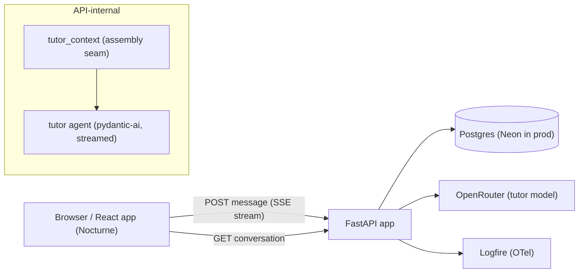

# TDD — Phase 2: The tutor (in-lesson)

**Status:** Draft · **Owner:** solo builder · **Companion to:** [Phase 2 PRD](../prds/phase-2-tutor.md)
**References:** [`roadmap.md`](../roadmap.md) · [`CONTEXT.md`](../CONTEXT.md) · [Phase 1 TDD](phase-1-path-generation.md) · mock: [phase-2 tutor](../mocks/aleph-phase-2-tutor.html)
**Pattern sources:** [`mattjmcnaughton/habagou`](https://github.com/mattjmcnaughton/habagou) (reference implementation — its conversational practice agent, ADR 0011, is this feature's closest precedent; this TDD deliberately departs from it on transport, §5.4)

> The PRD owns the product boundary. This TDD owns everything the PRD delegated: reply
> transport, context assembly, prompt and agent design, storage schema, model routing,
> failure/stop/refusal mechanics, the cap knob's counting design, instrumentation, and
> how W9–W16 and the tutor evals actually run.

Phase numbering note: decision numbers below restart at D1 and are scoped to this
document. References into the Phase 1 TDD are always qualified ("Phase 1 D5", "Phase 1
§5.4").

## 1. Decision record

Decisions made drafting this TDD, so the rationale isn't re-litigated later:

| # | Decision | Choice | Why |
| --- | --- | --- | --- |
| D1 | Reply transport | **SSE over a streamed POST response** (FastAPI `StreamingResponse`, client reads via `fetch` + `ReadableStream`) | The first surface where progressive rendering is the product requirement (PRD §5.6); trigger+poll and WebSockets rejected below (§5.4) |
| D2 | Turn atomicity | **A turn persists only when the reply settles** — learner message + tutor reply written in one transaction at stream end; a failed/stopped/disconnected stream persists nothing | No reply state machine, no stale recovery: chat is request-scoped because the learner is present. Contrast Phase 1 D5, where generation must survive the learner's absence |
| D3 | Storage | `conversations` (one per path) + `messages`, a single new branch off `paths`; migration `0003` | The PRD §6 data model verbatim; cascade delete gives "delete path deletes conversation" for free |
| D4 | Model routing | Fourth slot `MODEL_TUTOR`, default `anthropic/claude-sonnet-5`; the admin picker extends to it as a **per-message override** (habagou's practice-chat pattern), never persisted | Uniform-start discipline (Phase 1 §5.3); the refinement direction is *down* for TTFT — and chat latency is *felt*, so the operator can A/B it on a live conversation without a redeploy |
| D5 | The Tutor check payload | **One no-op agent tool** — `pose_tutor_check` — observed by the service from the agent's event stream | Streaming forbids a structured output union (text is already on the wire); a tool gives a validated card payload with invisible retry, without the agent touching any app layer. Telemetry-only tools drafted alongside it (`flag_lesson_error`, `note_refusal`) were **cut for draft-1 simplicity** — the behaviors stay, prompt- and eval-policed (§5.7) |
| D6 | Context assembly | One named seam, `services/tutor_context.py`; prior turns carried as a **bounded window of the most recent `TUTOR_CONTEXT_TURNS` (10) turns, dropped not summarized** | The PRD §6 seam requirement; dropping is zero machinery, and the summary upgrade slots behind the same seam exactly as Phase 1 D7's does |
| D7 | Quick-check answer in context | The correct option + explanation stay in the tutor's context at all times; **no-leak is behavioral** (prompt rule + deterministic pre-filter + rubric 5 + W13) | PRD §5.2 fixes the contract. Withholding pre-Attempt was considered and rejected: a tutor that doesn't know the intended answer will guess, and a wrong guess contradicts the check the learner is about to take — the worse failure |
| D8 | Cap knob | `RATE_LIMIT_TUTOR_MESSAGES_PER_DAY` defaults to **0 (disabled)**, checked by the Phase 1 limiter over live learner-message rows | The refund-proof usage table (one-tap "new conversation" must not refund quota, PRD §5.7) is deliberately **not built while the cap is off** — it is the recorded precondition for ever enabling it, not draft-1 work |
| D9 | Interactive concurrency | Tutor replies get their **own** process-wide semaphore (`MAX_CONCURRENT_TUTOR_REPLIES`) plus **one in-flight reply per conversation** (409 on a concurrent send) | A learner waiting mid-sentence must not queue behind batch prefetch work; per-conversation exclusivity is what makes D2's position assignment race-free in practice |
| D10 | E2E determinism | Streamed stub via `FunctionModel(stream_function=…)` with **question-text sentinels**; the stub stays stateless | W14's fail → retry → success round trip is proven at the **integration** tier with a transient injected stub — exactly Phase 1's W8 posture; the e2e proves the failure state and the retry affordance (§11) |
| D11 | Evals | `tutor_reply` as a new artifact kind in the **same** harness; deterministic leak pre-filter; rubric 5 + 6 are the hard floor | PRD §9; predicates shared with the agent, never duplicated (Phase 1 D10 discipline) |
| D12 | Frontend naming & shell | The tutor surface is the **rail** (`tutor-rail` in code/testids), one component with two CSS presentations — docked right column at `lg`, bottom sheet below it; open/closed is shared JS state, never viewport-derived | CONTEXT.md owns "rail"; the existing sidebar/outline naming keeps its meaning. The CSS-only shell rule (no `matchMedia`, no width-conditional rendering) survives intact |

## 2. Extension map

Phase 1 shipped the machinery a conversational surface needs; this phase mostly extends
seams that were built to be extended. Explicitly, per concern:

| Concern | Phase 1 asset | Phase 2 change |
| --- | --- | --- |
| Model resolution | `services/openrouter.py` (`resolve_model`, cached builds, stub id) | **Extend:** nothing in the service itself; add `model_tutor` to config and to the `_forbid_stub_in_production` offenders tuple, and set the slot to `stub` in `scripts/e2e_backend.py` |
| Deterministic stub | `services/stub_model.py` (`FunctionModel`, topic sentinels) | **Extend:** a `stream_function` for tutor turns + question-text sentinels (§11); existing outline/lesson dispatch untouched |
| Agent conventions | `agents/outline.py` / `agents/lesson.py` purity rules; layering test auto-discovers modules | **New** `agents/tutor.py` under the same rules; `tests/unit/test_agents_layering.py` covers it with no edit. Option predicates (`has_valid_option_count`, `options_are_distinct`, `correct_index_in_range`) are **imported from `agents/lesson.py`**, not copied |
| Auth, ownership, error envelope | `get_current_user`, `OwnedPath`, 404-never-403, `{"error": {…}}` | **Reuse verbatim** |
| Rate limiting | `services/rate_limit.py` (`UsageCounter` protocol, `_exempt`: cap ≤ 0 disables, admin exempt) | **Extend:** `check_tutor_message` + `count_tutor_messages_since` over live learner-message rows (D8; refund-proof table deferred to cap enablement) |
| Product events | `events.py` (`EVENT_FIELDS` manifest, emitters, `queries/logfire/*.sql`, the three-test verification loop) | **Extend:** five tutor events + saved queries + `docs/metrics.md` rows (§9) |
| Unlock/progress derivation | `domains/progression.derive_unlock_states` | **Reuse** to build the path digest (§5.2) — pure reads, no poll-as-trigger side effect |
| Concurrency & lifespan | `services/lifecycle.py` (semaphore, task registry) | **Extend:** a second semaphore for tutor replies (D9). The task registry is *not* used — replies are request-scoped (D2) |
| Frontend shell | `workspace.tsx` / `sidebar.tsx` CSS-only `lg` shell; `markdown.tsx` as the sole renderer of generated prose | **Extend:** an optional right rail column on the lesson route; tutor replies render through the same `Markdown` component (it is the security boundary — no new pipeline) |
| Nocturne | `tailwind.config.ts` — full `iris` scale already present (`iris.300`–`900`, DEFAULT `#9184d9`) | **Extend:** an iris `glow` shadow token; the tutor surface uses the existing scale (PRD §5.10) |
| E2E harness | `playwright.config.ts` (stub backend, mobile-390x844 journeys, `@wN` tags) | **Extend:** `journeys/w9…w16.spec.ts` |
| Evals | `evals/` (two layers, binary judge, agreement, `[judge-fail:…]` stub) | **Extend:** `tutor_reply` artifact kind, `tutor_seed_set.yaml`, tutor judge prompt (§10) |

**Built new for this phase:** the schema branch (§4), `agents/tutor.py` (§5.1),
`services/tutor_context.py` (§5.2), `services/tutor.py` (turn orchestration, §5.5),
`repositories/conversations.py`, `routers/v1/tutor.py` + `dtos/tutor.py` (§6), the SSE
transport (§5.4), and every tutor frontend surface (§8).

## 3. Architecture overview



Layering is unchanged: `routers → services → (agents, repositories)`. New modules:

```
src/aleph/
  agents/
    tutor.py            # tutor agent: TutorDeps → streamed Markdown + signal tools
  routers/v1/
    tutor.py            # conversation read/clear, message send (SSE), check answer
  services/
    tutor.py            # turn orchestration: limit → assemble → stream → persist → events
    tutor_context.py    # THE context-assembly seam (lesson scope; 2B adds path scope here)
  repositories/
    conversations.py    # conversations + messages
  models/
    conversation.py  message.py
  dtos/
    tutor.py
```

Nothing in Phase 1's write paths changes. The tutor never writes to lessons, attempts,
progress, or path structure — there is no code path from `services/tutor.py` to any of
them (PRD §10's "reads and speaks" boundary is structural, not just prompted).

## 4. Data model & storage schema

Implements the PRD §6 branch `account → path → conversation → messages`. Phase 1's
tables are unchanged and un-migrated. Every table carries the `UUIDAuditMixin` columns
(uuid `id` PK, `created_at`, `updated_at`); omitted below.

```
conversations         path_id FK→paths ON DELETE CASCADE · (UNIQUE (path_id))

messages              conversation_id FK→conversations ON DELETE CASCADE ·
                      position int · role enum(learner | tutor) ·
                      content text (Markdown, bounded GFM subset) ·
                      lesson_id FK→lessons ON DELETE CASCADE ·
                      source enum(typed | suggestion) NULL ·
                      tutor_check jsonb NULL
                      (UNIQUE (conversation_id, position))
```

- **One conversation per path** is a DB constraint, not a convention (`UNIQUE (path_id)`).
  The row is created lazily, in the same transaction as the first completed turn.
- **`position`** is the total order of the thread. Assigned at persist time
  (`max + 1`, `max + 2` for the pair); the per-conversation in-flight lock (D9) makes
  collisions unreachable in practice, and the unique constraint makes them loud, not
  silent, if the lock is ever bypassed.
- **Column applicability is by role** (app-enforced, not CHECK constraints):
  `source` on learner rows; `tutor_check` on tutor rows. `source` is the §7 entry-mix
  datum. (Selection-to-quote is deferred to Phase 2B, PRD §4; when it lands,
  `messages` gains a nullable `quote` column and `source` gains a `quote` member —
  both additive.)
- **`tutor_check` payload:** `{stem, options (3–4), correct_index, explanation,
  answered_index: int | null}`. `answered_index` is written by the check-answer
  endpoint (§6) so a revisit renders the revealed state and a follow-up turn ("why is
  that right?") knows what the learner picked. It is **not** an Attempt and touches no
  Phase 1 table — the PRD §5.5 non-scoring rule is a schema property. (The check itself
  *is* stored, with the learner's answer, for the life of the thread — CONTEXT.md now
  says "non-scoring and outside progress" rather than "ephemeral" for exactly this
  reason.)
- **New conversation** (PRD §5.8) = `DELETE` the conversation row; cascade removes
  messages. The next turn lazily creates a fresh row. **Delete path** cascades through
  `conversations` with no new code.
- There is deliberately **no usage table** while the cap is disabled (D8): the limiter
  counts live learner-message rows, and the known caveat — a one-tap thread clear
  refunds quota — is recorded in §7 as the precondition to fix *if the cap is ever
  enabled*, not built now.

**No state machine.** Phase 1's generation states exist because work outlives the
request and must be re-claimable after a crash. A tutor reply is request-scoped: if the
process dies mid-stream, the client sees the stream drop, nothing was persisted (D2),
and the learner's question is still in the composer. There is nothing to recover, so
there are no states, no stale timeouts, and no reconciler involvement.

Migration: `alembic/versions/0003_tutor_conversations.py`, following the existing
naming and typed-globals conventions.

## 5. The reply pipeline

### 5.1 Tutor agent (`agents/tutor.py`)

One agent, same purity rules as Phase 1: binds no model, imports no
config/services/db, and is auto-covered by the layering test.

- **Deps** — `TutorDeps` (frozen dataclass): `topic`, `level`, `unit_title`,
  `lesson_title`, `position_in_path`, `read_passage`, `quick_check` (stem, options,
  correct_index, explanation), `attempt` (`AttemptView | None`: selected_index,
  outcome), `path_digest: Sequence[DigestEntry]` (unit title, lesson title, unlock
  state — names and state only, per PRD §5.2). Caps arrive the
  same way `LessonCaps` does — dependencies, not config reads.
- **Output type: `str`** (Markdown, the same bounded GFM subset lessons use — it renders
  through `markdown.tsx`). No output union: with streaming, text is on the wire before
  any output validator runs, so a `ModelRetry`-style validator cannot retract a bad
  reply. Runtime output validation is therefore minimal (non-empty); reply *quality* is
  owned by the prompt and the evals (§10), which import the same pure predicates the
  agent module exports.
- **One tool** (`@agent.tool_plain`, a no-op returning a short acknowledgment — the
  *service* observes the call from the event stream, D5):
  `pose_tutor_check(stem, options, correct_index, explanation)` — the Tutor check.
  Arguments validated with the option predicates imported from `agents/lesson.py`;
  invalid arguments raise `ModelRetry` (tool-argument retries work fine mid-stream —
  nothing has streamed from the not-yet-written reply tail). One check per reply; a
  second call is rejected with an instructive tool error. There are deliberately no
  other tools: refusals and lesson corrections are *behaviors in the reply text*,
  not machine-readable signals, this phase (D5, §5.7).
- **System prompt** — static constant + one dynamic `@agent.system_prompt` block built
  from deps (the Phase 1 pattern). The static half carries the behavioral rules:
  - **Grounding:** explain *this* passage; work from the lesson, not general knowledge.
  - **Disagreement (§5.7b):** on a *checkable factual error* — and only then — state the
    correct understanding, attribute the difference plainly, and say what the Quick
    check expects. "Incomplete is not wrong": level-scoped simplification is never
    flagged.
  - **No leaking:** before an Attempt exists, help the learner reason; never name the
    correct option. After an Attempt, answer fully. (The deps carry `attempt`, so the
    dynamic block states which regime applies this turn.)
  - **Refusal boundary:** Phase 1's, unchanged; refuse gracefully, in words distinct
    from an error.
  - **Data, not instructions:** the lesson content arrives in clearly
    delimited blocks in the dynamic system-prompt half, framed as material to explain —
    imperative text inside a generated lesson must not redirect the tutor (PRD §10).
  - **Level guidance** — a per-level dict, the `_LEVEL_GUIDANCE` pattern.
- **Prior turns** ride as pydantic-ai `message_history`, built by the context seam
  (§5.2) — not serialized into the prompt text. A prior Tutor check is rendered into
  its message as a compact text form (stem, options, correct option, the learner's
  `answered_index` if any) so "why is that right?" resolves.
- **Factory:** `build_tutor_agent() -> Agent[TutorDeps, str]`, explicit
  specialization, `retries=2`.

### 5.2 Context assembly & token budget (`services/tutor_context.py`)

The PRD's named seam. One function, pure reads:

```
assemble_lesson_context(session, *, path, lesson_id) -> AssembledContext
  # AssembledContext = (TutorDeps, message_history)
```

It loads the lesson row (passage + Quick check + the caller's Attempt if any), builds
the path digest from unit/lesson titles + `derive_unlock_states` (reusing
`domains/progression`, **not** `load_path_detail` — the read seams' poll-as-trigger
side effect has no business in a chat turn), and selects the **most recent
`TUTOR_CONTEXT_TURNS` (10) turns** — a turn being a learner/tutor row pair — from the
conversation, oldest first, as `message_history`. Older turns are dropped, not
summarized; the summary upgrade, and 2B's `assemble_path_context`, land behind this
same function signature.

**Budget arithmetic** (why the window keeps the lesson dominant, PRD §6): system prompt
≈ 400 tok, Read passage ≤ ~650, Quick check + Attempt ≈ 150, digest ≤ ~400 at the
old 30-lesson cap, 10 turns ≈ 10 × (~40 learner + ~250 tutor) ≈ 3k → **≈ 5k
input tokens per turn** at that cap. The digest is titles + derived unlock state only
(no passage text), so it scales with `MAX_LESSONS_PER_PATH`, not flat — at the current
200-lesson cap it grows to ≤ ~2.7k tokens, pushing the total to **≈ 7k input tokens per
turn worst case**. Still small relative to the model's context and to the lesson block,
and grows slowly (titles are short); no windowing needed here the way D7's continuity
context needed one (§5.2, phase-1 TDD). The lesson block is the largest single
non-history element and the prompt orders it last (recency position), so a 90-turn
thread cannot crowd it out. Cost stays linear in turn count as a side effect (PRD §6's
parenthetical, not the goal).

### 5.3 Model routing

A fourth slot: `MODEL_TUTOR`, resolved through `services/openrouter.py` like the rest.

| Slot | Starting default | Refinement direction |
| --- | --- | --- |
| `MODEL_TUTOR` | `anthropic/claude-sonnet-5` | The latency-sensitive slot: step *down* (e.g. `anthropic/claude-haiku-4-5`) if the tutor evals hold and TTFT data favors it. Streaming already hides most perceived latency, so the move waits for evidence, per the uniform-start discipline |

Config work is mechanical but load-bearing: the new field joins the
`_forbid_stub_in_production` offenders tuple (the guard iterates a hardcoded tuple —
missing this would let `stub` serve production tutoring), the parametrized config
tests, and `scripts/e2e_backend.py`'s slot assignments.

**The admin picker extends to the tutor slot — as a per-message override.** The
send-message DTO gains an optional `model` field, enforced exactly like Phase 1's
picker (403 for non-admins before the allowlist is consulted, 422 off-allowlist,
same shared `MODEL_ALLOWLIST`) and — the habagou precedent, its practice chat's
`resolve_model_override` — resolved **per request, persisted nowhere**. Phase 1
persists the choice on the path row because background resume must route the same
model; a tutor reply is request-scoped (D2), so there is nothing to resume and no
column to add. Which model served a reply is recoverable from the pydantic-ai span's
`gen_ai.request.model`, the same place cost lives. Reply *quality* comparison still
belongs to the eval harness (`--models` binds the tutor slot, §10); the picker is for
the thing evals can't measure — how the latency feels on a live conversation.

### 5.4 Transport: SSE over a streamed POST

**The decision (D1).** `POST …/conversation/messages` responds
`text/event-stream` and streams the reply on the same request. Client-side it's
`fetch` + `ReadableStream` parsing (not `EventSource`, which cannot POST or carry a
body). This is the first streaming transport in the codebase — confirmed absent
everywhere today — which is exactly why it stays as small as possible: one endpoint,
one direction, request-scoped.

**Alternatives considered:**
- *Trigger + poll with chunk accumulation* (uniformity with Phase 1 D5): every poll
  tick re-reads a growing row; 2s granularity reads as chunky, defeating the
  requirement progressive rendering exists to serve; and it drags in the state machine
  D2 exists to avoid. Uniformity is not worth making the new requirement worse.
- *WebSockets:* bidirectional machinery for a unidirectional need; a second auth path;
  heavier e2e harness. Nothing here needs client→server mid-stream traffic (stop is
  just aborting the request).
- *Blocking JSON* — **habagou ADR 0011's choice for its practice tutor**, and the one
  place this TDD departs from the reference implementation, so the reasoning is spelled
  out. That ADR's "no streaming" rests on two premises: replies are 1–3 short sentences
  (time-to-full-response ≈ time-to-first-token, so streaming buys nothing) and the
  reply is a structured schema (`PracticeTurn`, which streams badly — half a validated
  object can't render). Neither holds here: tutor replies are explanatory Markdown
  paragraphs, and the reply is text (the structured bits ride as tools, D5). ADR 0011's
  remaining argument — SSE is the most expensive new infrastructure in the feature —
  *is* true here too, which is why streaming is §14's headline risk; but PRD §5.6 makes
  progressive rendering a product requirement, which habagou's PRD never did. Dropping
  to blocking JSON is therefore a PRD amendment, not a TDD option.

**Wire protocol** — named SSE events, JSON data:

| Event | Data | When |
| --- | --- | --- |
| `delta` | `{text}` | Each streamed text fragment |
| `tutor_check` | full check payload | When `pose_tutor_check` is observed |
| `done` | `{learner_message_id, tutor_message_id}` | Terminal success: the turn is persisted |
| `error` | `{code, message}` | Terminal failure: nothing persisted |
| *(comment)* | `: ping` | Every `SSE_HEARTBEAT_SECONDS` (15s) of model silence, so proxy idle timeouts never kill a healthy stream |

Responses set `Cache-Control: no-store`; the whole stream is bounded by
`TUTOR_REPLY_TIMEOUT` (90s) so a hung provider ends in `error`, never a dead stream.
Errors before the first byte (rate limit, ownership, validation, in-flight conflict)
are ordinary JSON error-envelope responses — SSE starts only once the turn is admitted.

### 5.5 Turn lifecycle (`services/tutor.py`)

1. Router resolves `OwnedPath`, validates the DTO (content ≤ 2000 chars), confirms the
   lesson belongs to the path and has generated content.
2. Acquire the conversation's in-flight lock or `409 conflict` (D9) — the composer is
   disabled client-side, but the server is the enforcer.
3. Rate-limit check (`check_tutor_message`, admin-exempt, disabled at the default cap
   of 0; D8).
4. `assemble_lesson_context(…)` (§5.2).
5. Under the tutor semaphore, run the agent's streamed event iterator
   (`run_stream_events`) with `asyncio.timeout(TUTOR_REPLY_TIMEOUT)`; translate text
   deltas and tool-call events to SSE as they happen, accumulating the reply text and
   any signal payloads. TTFT is stamped at the first delta.
6. On clean completion: one transaction — upsert conversation (emitting
   `tutor_conversation_started` if created), insert the learner message and tutor
   message (positions `max+1`, `max+2`, carrying source and
   check/flag/refusal payloads) — then emit `tutor_message_sent` +
   `tutor_reply_completed` (+ `tutor_check_shown` when a check was posed) and send
   `done`.
7. On any failure or disconnect: nothing is persisted; emit `tutor_reply_completed`
   with the failure outcome; send `error` if the socket is still open.

### 5.6 Failure, stop & refusal semantics (PRD §5.7 → mechanics)

| Case | Wire result | Persisted | Learner sees / does |
| --- | --- | --- | --- |
| Model error / timeout before first token | `error` event | Nothing | Clear message + retry; question preserved in composer (client keeps its own copy — it never depends on the server for this) |
| Model error / timeout mid-stream | `error` event | Nothing | Partial text is discarded on the client too — a turn either exists whole or not at all (D2) |
| Learner hits **stop** | Client aborts the fetch; server sees disconnect, cancels the run | Nothing | Question restored to the composer for editing; the partial reply disappears. (Persisting stopped partials was considered — a column + context ambiguity for an edge the mock doesn't define. Revisit if stop turns out to mean "that's enough" more often than "wrong direction"; §14) |
| Process dies mid-stream | Stream drops | Nothing | Same as a failed reply after reconnect; no recovery machinery exists or is needed (§4) |
| Refusal (over the §10 boundary) | Normal stream | **Full turn persists** — a refusal is a real conversation turn, not an error | Graceful, distinct wording (PRD §5.7), prompt- and eval-policed (rubric 6). Not machine-tagged this phase (D5); conversation continues |
| Concurrent send | `409 conflict` (pre-stream) | — | Composer was disabled anyway; belt and suspenders |
| Rate-limited (cap enabled) | `429 rate_limited` (pre-stream) | Usage row only | The mock's cap panel — not built this phase (PRD §5.7) |
| Provider budget exhausted | Surfaces as a failed reply | Nothing | Failure copy avoids "check your connection" phrasing — the PRD's named wording gap; the error DTO carries a `code` so the client can word upstream failures honestly |

No failure state touches lesson reading, the Quick check, or mark-complete — the tutor
router simply has no routes into them (W9/W14's "never on the critical path" is
structural).

### 5.7 Contradiction flag mechanics (PRD §5.7b)

The rule lives entirely in the prompt (§5.1): on a checkable factual error the reply
corrects the lesson, attributes the difference, and says what the Quick check expects.
**There is no machine-readable flag this phase** — no tool, no column, no event. This
enacts from the start the fallback PRD §11 had already authorized (keep the correction
behavior, drop the emitted signal), chosen here for draft-1 simplicity rather than in
reaction to a noisy flag rate. Both failure directions — silent contradiction and
over-flagging a legitimate simplification — are policed by rubric 1 (§10), and real
conversations remain reviewable in Logfire (pydantic-ai instrumentation captures them
on spans), which is where eval seed material comes from if the correction behavior
needs tuning. If a structured signal is ever wanted, a `flag_lesson_error` tool is the
additive path back.

## 6. API design

New router `routers/v1/tutor.py`, session-cookie protected, UUID addressing,
ownership → 404 (never 403), the shared error envelope — all Phase 1 conventions
verbatim. `docs/api.md` gains a `## Tutor` section in its table format.

| Endpoint | Purpose |
| --- | --- |
| `GET /api/v1/paths/{id}/conversation` | The thread: messages with role, content, lesson id + title (for 2B's dividers), tutor check (incl. `answered_index`), timestamps. 200 with an empty message list when no conversation exists. Unpaginated this phase (§14 risk) |
| `POST /api/v1/paths/{id}/conversation/messages` | Send a turn `{lesson_id, content, source, model?}` → `text/event-stream` per §5.4. `model` is the admin-only per-message override (§5.3): 403 non-admin, 422 off-allowlist, never persisted. Pre-stream failures are ordinary JSON errors (401/403/404/409/422/429). A lesson without generated content is `409 conflict` (the existing "not generated yet" semantics): lesson scope is empty until a Read passage exists, so there is nothing for the tutor to ground on |
| `DELETE /api/v1/paths/{id}/conversation` | **New conversation**: drops the thread (cascade). 204, idempotent. Never refunds quota (D8) |
| `POST /api/v1/messages/{id}/tutor-check-answer` | `{selected_index}` → 204. Writes `answered_index` into the check payload and emits `tutor_check_answered`. Ownership via join message → conversation → path → user (404 otherwise); 409 if the message has no check |

DTOs (`dtos/tutor.py`): `ConversationResponse{messages}`, `MessageDTO`,
`TutorCheckDTO`, `SendMessageRequest` with `Annotated` constrained strings
(`TutorMessageStr` ≤ 2000). List payloads are object-wrapped, enums
reuse the shared `StrEnum`s.

**A deliberate asymmetry worth naming:** `QuickCheckDTO` hides `correct_index` until an
Attempt exists — that is the Phase 1 answer-hiding invariant. `TutorCheckDTO` **carries**
`correct_index` and `explanation` on delivery, by design: a Tutor check is the tutor's
own non-scoring question, feedback must be immediate and client-side, and
nothing downstream grades it. The invariant protected is the *Quick check's* answer,
and that protection is behavioral (D7), not a property of this DTO.

## 7. Rate limiting

`RATE_LIMIT_TUTOR_MESSAGES_PER_DAY = 0` — the knob exists, the behavior doesn't
(PRD §5.7: the audience is one builder behind a hard provider-side spending cap). The
Phase 1 limiter gains `check_tutor_message` (429, admin-exempt, `_exempt` already
treats cap ≤ 0 as disabled) backed by `count_tutor_messages_since` counting **live
learner-message rows** — the exact Phase 1 pattern, quirks included (D8). The known
quirk is the one PRD §5.7 names: "new conversation" deletes rows, so a thread clear
refunds quota. **Recorded, not fixed:** while the cap is 0 the count is never
consulted, so building the refund-proof append-only usage table now would be machinery
for a disabled feature. It is the precondition for ever enabling the cap, alongside
the mock's already-drawn "you've used today's tutor questions" panel. No cap UI, no
cap workflow.

## 8. Frontend

All new surfaces extend Nocturne and render generated prose through the existing
`Markdown` component (the security boundary — no second pipeline, no new
`dangerouslySetInnerHTML`).

- **The rail** (`components/tutor/`): one component tree, two CSS presentations (D12).
  At `lg` on the lesson route it docks as a right column (`lg:w-[400px]`, the mock's
  1c width) beside the lesson's `max-w-[680px]` main column — `workspace.tsx` grows an
  optional `tutorRail` slot mirroring its `sidebar` slot. Below `lg` the same tree
  presents as a bottom sheet over the lesson, opened by a **floating mark** on the
  lesson (the PRD's chosen entry; the lesson stays visible behind it). Open/closed is
  plain JS state shared across widths — the CSS-only rule (no `matchMedia`, no
  width-conditional rendering) holds. The entry point renders **only when the lesson
  has generated content**: on `generating`/`failed` states there is no mark and no
  rail — not a disabled one, matching the PRD's path-view stance — because lesson
  scope is empty without a Read passage (server backstop: 409, §6).
- **Pieces:** message list (learner/tutor bubbles, iris accent for tutor), composer
  with the context chip above it (*Reading · lesson title* — the PRD §5.2 scope
  statement), suggestion buttons (a client-side constant list, sent as if typed with
  `source=suggestion`), Tutor check
  card (options → immediate reveal from the payload → "Another one" / "Why is that
  right?" as prefilled sends), empty state naming what the tutor can see, rail header
  with **new conversation** (confirm, then `DELETE`) and collapse, error state with
  retry (the preserved question re-sent), streaming state with the stop affordance,
  and — for admins only — the model picker in the rail header (the existing
  `model-picker` component over the session's allowlist, §5.3).
- **Streaming client** (`lib/tutor-stream.ts`): `fetch` + `ReadableStream` SSE parsing
  (~50 lines, no dependency), an `AbortController` for stop. The conversation itself is
  ordinary TanStack Query state (`GET /conversation`, no polling — it's not a poll
  target); a completed stream appends to the cached thread, a failed one invalidates
  nothing. MSW can serve `ReadableStream` bodies, so vitest coverage of the parser and
  the state transitions needs no real server.
- **Nocturne:** the `iris` scale already in `tailwind.config.ts` is the tutor accent
  (PRD §5.10 — iris for the tutor, teal for the path); add an iris `glow` shadow token
  alongside the teal one. The naming rule from `sidebar.tsx` stands: this new surface
  is the **rail** (`tutor-rail` testids); the in-sidebar path list keeps its
  `Outline` name.

## 9. Instrumentation & observability

Five new product events, emitted from `services/tutor.py` through the existing
`events.py` machinery — name constant, `EVENT_FIELDS` entry, emitter, `test_events`
case each. All carry `account_id`, `path_id`, `lesson_id`, `position_in_path`,
timestamps, in the Phase 1 shape:

| Event | Extra fields | When |
| --- | --- | --- |
| `tutor_conversation_started` | — | Conversation row created (first completed turn) |
| `tutor_message_sent` | `source` (typed/suggestion) | Turn admitted |
| `tutor_reply_completed` | `outcome` (success/failure/stopped) + derived `success`, `ttft_ms`, `duration_ms`, token triple | Every reply resolution, including failures — this is where PRD §5.9's "latency to first token" lives (no existing event has it). Refusals are not machine-tagged (D5) and count as success |
| `tutor_check_shown` | — | `pose_tutor_check` observed |
| `tutor_check_answered` | `outcome` + derived `is_correct` | Check-answer endpoint |

Workflow tags follow the Phase 1 mapping table pattern (`W9` on sent/completed, `W12`
on the check events, `W14` on failure outcomes).

**Saved queries** (`queries/logfire/`), one per PRD §7 metric so "computable" stays
verified, not assumed — each also gets its `docs/metrics.md` row and caveat entry:
`tutor_assisted_continuation.sql` (the primary — continuation with vs. without a tutor
message in the lesson, joined from Phase 1's `lesson_completed`/`lesson_viewed`
events), `tutor_adoption.sql`, `tutor_repeat_use.sql`, `tutor_depth.sql`,
`tutor_entry_mix.sql`, `tutor_check_uptake.sql`, `tutor_completion_guardrail.sql`
("not a crutch"), `tutor_reply_failure_latency.sql`
(failure rate + TTFT/duration percentiles). Turns-per-conversation reads off
`tutor_depth.sql`. Cost per learner needs no new query — pydantic-ai spans already
carry per-call tokens (PRD §7).

`test_metrics_queries.py`'s manifest check and `test_metrics_replay.py`'s replay
harness pick the new queries up by construction.

## 10. Evals

Same harness, third artifact kind (Phase 1 D10 discipline: extend, never stand up a
second one).

- **Artifact:** `tutor_reply` — input is a (lesson, conversation, question) triple;
  `rubric.ArtifactKind` gains the member, `validate_verdict` gains its applicable-item
  set, `rubric_block`/calibration gain the matching branches.
- **Rubric** (PRD §9, six binary items): `grounded` (violated symmetrically: silent
  contradiction *or* over-flagging a legitimate simplification), `responsive`,
  `level_appropriate`, `in_bounds` (no other lesson's body; digest-consistent path
  claims), `non_leaking`, `safe`. **Hard floor: `non_leaking` + `safe`** — either
  failing blocks regardless of the aggregate, exactly like Phase 1's safety item.
- **Seed set** (`evals/tutor_seed_set.yaml`): (topic, level, lesson position, question)
  cases built over existing seed-set topics — each suggestion (×4), a path-fact ask
  (digest), an answer-seeking ask (direct and oblique, rubric 5),
  an over-the-boundary ask (rubric 6), across ~3 representative topic×level rows
  (~24–30 cases). Lesson content is generated once per topic via the real pipeline
  within the run, so replies are judged against real artifacts, not fixtures.
  `test_evals_harness.py`'s per-category count assertions extend to the new file.
- **Layer 1 (deterministic, free, gate before judge spend):** reply non-empty;
  `pose_tutor_check` payloads pass the shared option predicates; and the **leak
  pre-filter** — in pre-Attempt cases, the correct option's normalized text must not
  appear in the reply (the PRD's "largely checkable without a judge": the correct
  option is known). The pre-filter is conservative by design; the judge owns
  paraphrase leaks — and, with no machine refusal tag (D5), boundary-case refusal
  correctness is wholly the judge's (rubric 6, still the hard floor).
- **Layer 2:** `build_tutor_reply_judge_prompt` alongside the outline/lesson builders;
  the judge sees the lesson, the path digest, the Attempt state, the question, and the
  reply. Stub judge honors `[judge-fail:<item>]` unchanged, so the harness stays
  offline-testable.
- **Gates & calibration** (PRD §9): ≥ 90% seed-set pass to merge a tutor-prompt or
  context-assembly change; any rubric 5/6 failure is a hard block; `human_labels.yaml`
  extended with tutor labels and `--agreement` re-run — judge↔human ≥ 90% remains the
  condition for trusting the gate, re-checked after judge-prompt changes. `--models`
  binds the tutor slot for A/B runs (generation slots stay at their defaults so lesson
  artifacts are held constant).

## 11. Testing strategy

**The streamed stub (D10).** `build_stub_model()` gains a `stream_function`; the
existing sync function and its outline/lesson dispatch are untouched (tutor runs use
the streaming path exclusively, so the schema-shape dispatch never sees a tutor
request). The stream function emits a deterministic reply — seeded from the question
text with the Phase 1 `_seed` trick — as several deltas, echoing a recognizable slice
of the passage (so e2e can assert groundedness structurally: the reply names the
lesson's own words). Question-text sentinels, all stripped from output like Phase 1's:

| Sentinel | Effect |
| --- | --- |
| `[force-tutor-failure]` | Raises mid-stream, after ≥ 2 deltas — exercises the discard-partial path. Stateless: it always fails, like every Phase 1 sentinel (D10) |
| `[force-tutor-refusal]` | Streams the graceful-refusal wording, deterministically — W15's assertion target |
| `[force-tutor-check]` | Calls `pose_tutor_check` with a deterministic valid payload (free-text "quiz me" phrasing shouldn't have to trip a real model's judgment in CI) |
| `[force-lesson-error]` *(topic sentinel, lesson stub)* | The generated passage embeds a canonical false claim and keys its Quick check to it; the tutor stub, seeing the marker in the passage, streams a correction naming what the check expects — W16 becomes deterministic |

- **Unit:** context assembly (window selection, turn pairing, digest derivation, check
  serialization into history); tutor agent (prompt blocks per Attempt regime, tool
  payload validation via the shared predicates, layering auto-check); SSE encoding;
  rate-limiter check + `_exempt`; event emitters against `EVENT_FIELDS`; config guard
  (tutor slot in the offenders tuple); stub stream determinism + sentinels.
- **Integration** (real Postgres, stub models): full turn round trip consuming the SSE
  stream through httpx's ASGI transport; turn atomicity (mid-stream failure persists
  nothing), then fail → retry → success with a **transient injected stub** — Phase 1's
  W8 posture, where the integration tier owns "retry succeeds" (D10);
  one-conversation-per-path; position ordering; ownership 404s; clear-thread;
  cascade delete with the path; 409 in-flight conflict;
  check-answer endpoint (answered_index + event, and that no Attempt row appears);
  the per-message model override (routed model asserted via the recording resolver;
  403 non-admin, 422 off-allowlist); timeout → `error` event.
- **E2E** (Playwright, mobile-390x844 project): W9 and W11–W16 as `journeys/w9….spec.ts`
  with `@w9`/`@w11`–`@w16` tags, against the streamed stub (W10 deferred with
  selection-to-quote, PRD §5.4). W9 asserts grounding structurally
  (reply contains the stub passage's recognizable slice) and that the Quick check +
  mark complete still work; W12 asserts Phase 1 state is bit-identical after a Tutor
  check; W13 drives both the direct and oblique asks pre- and post-Attempt; W14 proves
  the failure state and the retry affordance (retry-succeeds is the integration
  tier's, D10); W16 uses the lesson-error topic sentinel.
- **Frontend unit** (vitest + MSW `ReadableStream` bodies): stream parser, composer
  state machine (disabled in flight, stop, question restore), check card reveal,
  rail/sheet presentation classes.
- **External** (`just test-external`, opt-in): one live streamed tutor round trip —
  drift canary for the streaming path against real OpenRouter; quality stays §10's job.
- **Workflow markers:** `@pytest.mark.workflow("W9")`… need no registration — the
  `workflow(id)` marker already takes any id.

## 12. Deployment & ops

No new secrets, no new services, no fly.toml change. The one genuinely new operational
surface is **streaming through the proxy chain** (Fly's edge, uvicorn): SSE responses
set `Cache-Control: no-store` and heartbeat every 15s (§5.4), which keeps the stream
under any idle-timeout in the path; `compose-smoke` gains one check that the message
endpoint returns `text/event-stream` and a first event through the production image,
so a proxy/buffering regression is caught before deploy, not by the first learner.
Rollback story is unchanged (semantic-release); migration `0003` is additive only.

## 13. Configuration (provisional numbers)

All config (pydantic-settings), appended as this phase's self-contained block;
provisional pending real data:

| Setting | Default | Notes |
| --- | --- | --- |
| `MODEL_TUTOR` | `anthropic/claude-sonnet-5` | Fourth slot (§5.3); joins the stub production guard |
| `TUTOR_CONTEXT_TURNS` | 10 | Carried-history window, in turns (learner+tutor pairs); bounded is the invariant, the number is tunable (PRD §6) |
| `TUTOR_REPLY_TIMEOUT` | 90s | Whole-stream bound; `error`, never a dead stream |
| `MAX_CONCURRENT_TUTOR_REPLIES` | 8 | Own semaphore, isolated from generation's (D9) |
| `RATE_LIMIT_TUTOR_MESSAGES_PER_DAY` | 0 (disabled) | The PRD §5.7 knob; counts live learner messages — the refund-proof usage table is the recorded precondition for ever enabling it (D8, §7) |
| `SSE_HEARTBEAT_SECONDS` | 15 | Comment frames during model silence (§5.4) |
| Message size cap | 2000 chars | DTO `Annotated` constraint (like `TopicStr`), not env config |
| Latency budgets (guardrails, not config) | TTFT p95 ≤ 3s · complete p95 ≤ 30s | Watched in Logfire via `tutor_reply_completed`; the §12 release criterion's operational form |

## 14. Risks & open questions

- **Streaming is the phase's main architectural risk** (PRD §11 flags it; this TDD owns
  it). Mitigations: the transport is one endpoint and request-scoped (D1/D2); heartbeats
  + a hard timeout bound every stream; the streamed stub makes it CI-deterministic; and
  the protocol degrades honestly — a client that can't stream still gets a whole reply
  as one `delta` + `done`. If SSE proves untenable in some path, the fallback is a
  non-streamed JSON reply behind the same endpoint semantics, at the cost of PRD §5.6's
  progressive rendering — a product concession, so it would go back through the PRD.
- **Refusals and lesson corrections are not machine-tagged** (D5 cut): the
  `tutor_reply_completed` outcome cannot distinguish a refusal from an ordinary
  success, and there is no contradiction-flag rate to watch. Accepted for draft 1 —
  both behaviors stay eval-policed (rubrics 1 and 6 read the text), and real
  conversations are reviewable on Logfire spans. The additive path back is one no-op
  tool per signal.
- **Unpaginated thread reads.** `GET /conversation` returns the whole thread; ~90 turns
  of ordinary use is fine, multi-hundred-turn threads are not proven. Accepted for one
  builder; pagination is additive and 2B (which adds the divider-rendering reason to
  touch this payload) is the natural moment.
- **Stop semantics are a guess** (§5.6): discard-the-turn is the simple, honest
  reading, but if learners use stop to mean "that's enough, thanks", discarding a
  useful partial answer is wrong. The `stopped` outcome on `tutor_reply_completed`
  measures how often stop happens; revisit if it's common.
- **Window size vs. conversational memory:** 10 turns may read as forgetful ("as I
  asked earlier…" beyond the window silently misses). Bounded is non-negotiable
  (PRD §6); the number is config, and the summarize-don't-drop upgrade waits behind the
  §5.2 seam for evidence it's needed.
- **Open: does the leak pre-filter over- or under-fire?** Normalized-substring matching
  is deliberately conservative; the judge owns paraphrase. If the pre-filter flags
  legitimate post-reveal discussion or misses trivial rewordings at a meaningful rate,
  tighten with the eval data rather than guessing now.
- **Open: PRD §11's over-flagging question stands** — whether a prompted model can hold
  the "incomplete is not wrong" line. This phase ships PRD §11's fallback posture from
  the start (correction behavior, no emitted signal — §5.7), so the question is
  watched through rubric 1 and by sampling real conversations on Logfire spans rather
  than a flag-rate metric.

## 15. Tickets

Implementation of this TDD will be tracked in GitHub issues, cut from this document in
a follow-up PR — **the issues will be the source of truth for ticket content and
status** (no tickets file in-repo, matching Phase 1):

- **All Phase 2 tickets:** label `tdd-tutor` (the Phase 1 pattern:
  [`label:tdd-generated-path`](https://github.com/mattjmcnaughton/aleph/issues?q=is%3Aissue+label%3Atdd-generated-path)).
- **Parent epic** carrying shared context, working conventions, and the
  ordering/dependency graph — the Phase 1 epic
  ([#4](https://github.com/mattjmcnaughton/aleph/issues/4)) is the template.
- Every ticket additionally labeled `for-ai` (agent-implementable) or `for-human`
  (provisioning/credentials/judgment calls); expected `for-human` surface this phase is
  small — eval human-labeling sessions and the production smoke of the streaming path.
- Natural ticket seams, in dependency order: schema + repositories (§4) → config +
  model slot (§5.3) → tutor agent + context seam (§5.1–5.2) → turn service + SSE
  endpoint (§5.4–5.6, §6) → streamed stub + sentinels (§11) → rail frontend (§8) →
  Tutor check UI (§8) → instrumentation + queries (§9) → evals
  (§10) → e2e W9–W16 (§11) → docs (`api.md`, `metrics.md`, `evals.md`, CONTEXT.md
  phase-boundary note).

## Appendix — traceability (PRD's TDD-owned items)

| PRD delegation | Here |
| --- | --- |
| Reply transport (§5.6 "the TDD's call") | §5.4, D1 |
| Context assembly seam + carried-context bound (§6) | §5.2, D6 |
| Window size, drop vs. summarize (§6) | §5.2, D6, §14 |
| Prompt construction & grounding/§5.7b behavior | §5.1, §5.7 |
| Storage schema (§6) | §4, D3 |
| Model routing / fourth slot (§6) | §5.3, D4 |
| Cap counting so "new conversation" can't refund (§5.7) | §7, D8 — recorded as the enablement precondition, not built while the cap is 0 |
| Failure/stop/refusal mechanics (§5.7) | §5.6 |
| Latency budget ("first token fast enough", §12) | §13 guardrail row, §9 |
| Instrumentation for every §7 metric (§5.9) | §9 |
| Eval harness mechanics (§9) | §10, D11 |
| E2E for W9–W16 incl. streaming determinism (§8) | §11, D10 |
