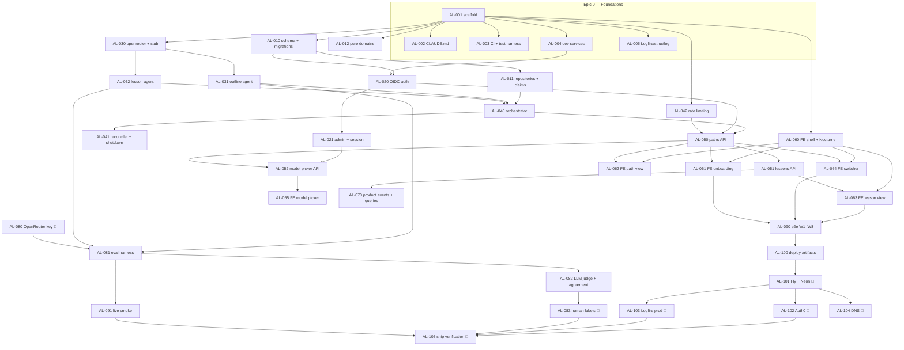

# Aleph — Phase 1 Ticket Breakdown

**Status: Draft v0.1 — for review.** Translates the [Phase 1 TDD](tdds/phase-1-path-generation.md)
into tickets. Destination: GitHub issues (one issue per `### AL-…` heading; AL-000 is the parent
tracking issue). Until then, this file is the source of truth.

Labels: every ticket carries **`for-ai`** (an agent implements it) or **`for-human`**
(provisioning, credentials, judgment calls only the builder can make). All `for-human`
deployment configuration (Fly, Neon, Auth0, DNS) deliberately comes last.

---

## AL-000 — Epic: Phase 1, the generated path (parent ticket)

This is the tracking ticket for Phase 1. It owns the ordering and the context that applies to
every child ticket. **Read this section before starting any ticket.**

### Shared context (applies to every ticket)

**Read first, in this order:**
1. [`docs/CONTEXT.md`](CONTEXT.md) — ubiquitous language. Use these exact terms in code,
   prompts, tests, and commit messages (say *path*, not "course"; *Quick check*, not "quiz").
2. [`docs/prds/phase-1-path-generation.md`](prds/phase-1-path-generation.md) — the product
   boundary, workflows W1–W8, metrics, release criteria.
3. [`docs/tdds/phase-1-path-generation.md`](tdds/phase-1-path-generation.md) — **the primary
   spec for every ticket.** Each ticket cites the TDD sections it implements; the ticket is a
   pointer + acceptance criteria, the TDD is the design. If a ticket and the TDD conflict, the
   TDD wins — flag the conflict in the PR.
4. Mocks: [web](mocks/aleph-mvp-web.html) · [mobile](mocks/aleph-mvp-mobile.html) — layout
   reference for frontend tickets (Phase 1 surfaces only; ignore tutor rail, streaks, stats).

**Pattern-source repos.** Many tickets list **Context needed** naming files in
[`mattjmcnaughton/templates`](https://github.com/mattjmcnaughton/templates) (the Copier
scaffold source) and/or [`mattjmcnaughton/habagou`](https://github.com/mattjmcnaughton/habagou)
(the reference implementation — TDD §2.2 says exactly what is copied/adapted from it). When a
ticket lists such context, clone the repo read-only and read the named files before writing
code; "adapt" means rename + trim habagou-specifics while keeping the pattern's shape and its
tests' shape. Tickets with no **Context needed** line need only this repo and its docs.

**Working conventions (definition of done for every `for-ai` ticket):**
- **Red-green TDD** for all behavioral code: write the failing test first (unit for pure
  logic and validators; integration for API/DB/claim behavior), watch it fail, make it pass,
  refactor. Exempt: mechanical scaffolding (AL-001), near-verbatim copies from habagou (still
  port/adapt the habagou tests that cover them), and visual styling — though frontend *behavior*
  (state machines, polling, reveal logic) still gets tests first.
- `just gate` green before every merge; `just gate-expensive` for tickets touching
  integration/e2e surface.
- [Conventional Commits](https://www.conventionalcommits.org/). Until first deploy, prefer
  `feat`/`fix`/`chore`/`test`/`docs` accurately — the release pipeline (AL-100+) will key off
  these.
- Tests proving a PRD workflow carry the marker: `@pytest.mark.workflow("W1")` (Playwright:
  `@w1` tag). No enforcement machinery (TDD §12) — the labels are vocabulary, review checks
  coverage.
- Layering rules are inviolable: `routers → services → (agents, repositories)`; `agents/`
  imports no services/routers/config/DB and binds no model; pure logic in `domains/`.
- One ticket ≈ one PR. If a ticket turns out to need splitting, split the PR, not the ticket
  scope.

### Ordering & parallelism

**Serialized spine:** AL-001 → AL-010 → AL-011 → AL-040 → AL-050 → AL-051 → AL-090 → AL-100 →
AL-101/102/103 → AL-105.

**Parallel lanes** (independent once AL-001 lands):
- **Lane A — data/domain:** AL-010 → AL-011; AL-012 anytime.
- **Lane B — auth:** AL-004 → AL-020 → AL-021 (AL-020 also needs AL-010's `users` table).
- **Lane C — models/agents:** AL-030 → AL-031 ∥ AL-032. Pure agents; no DB dependency.
- **Lane D — frontend shell:** AL-060 can start from the mocks immediately; AL-061–065 then
  consume APIs as they land.
- **Lane E — foundations polish:** AL-002, AL-003, AL-005 alongside everything.
- Evals (AL-081/082) parallel to the API/FE epics once agents exist.

**The one mid-stream human dependency** is AL-080 (OpenRouter key + repo secrets) — needed
before eval runs and live smoke, cheap to do early. Everything else `for-human` sits at the end.

---

## Epic 0 — Foundations

### AL-001 — Scaffold repo from templates `for-ai`
Deps: none. TDD: §2.1.
Scaffold into this existing repo (docs already live here) with Copier: `python-web` with the
answer table from TDD §2.1 (`project_name=aleph`, postgres + Alembic, `enable_otel=true`,
`include_clients=false`, technical/product docs **false**), then compose `frontend-react` into
`src/aleph/web/frontend/` with `is_composed=true`. Preserve the existing `README.md` and
`docs/` (merge, don't clobber — keep Aleph's README content, adopt the template's dev-loop
sections). Commit the `.copier-answers` files so template updates stay possible.
**Context needed:** `templates` repo — `templates/python-web/`, `templates/frontend-react/`
(read `copier.yml` for each), `docs/template-conventions/conventions.md`. habagou as the
worked example of the composed result (top-level layout only).
**AC:** `just dev` starts both servers; `just gate` green locally; `/healthz` + `/readyz`
respond; frontend dev proxy reaches the backend; existing docs untouched.

### AL-002 — CLAUDE.md / AGENTS.md: progressive disclosure `for-ai`
Deps: AL-001. TDD: §2.4.
Rewrite the scaffold-generated CLAUDE.md (AGENTS.md symlinked) into the short root file
described in TDD §2.4: just-command table, layering rules, commit conventions, test
organization, and *pointers* into `docs/` (TDD, PRD, CONTEXT.md) rather than inlined content.
Make CONTEXT.md's vocabulary authority explicit and prominent. This lands early because every
subsequent agent-implemented ticket reads it.
**Context needed:** `habagou/CLAUDE.md` — the shape to match.
**AC:** Root CLAUDE.md fits the habagou size envelope (~1 screen of load-bearing content +
links); a cold agent can find the TDD, the vocabulary, and the gate commands from it alone;
AGENTS.md symlink intact.

### AL-003 — CI pipeline & test-harness skeleton `for-ai`
Deps: AL-001. TDD: §12.
Verify/adapt the template's GitHub Actions: gate job on every PR; integration job with a
`postgres:16` service container; e2e job (Playwright, phone viewport project 390×844).
Register the `workflow` pytest marker in `pyproject.toml`; add the `external` marker and
exclude `tests/external/` from CI (opt-in only, TDD §12). Test tree: `tests/unit/`,
`tests/integration/`, `tests/e2e/`, `tests/external/`.
**Context needed:** `habagou/.github/workflows/` and `habagou/docs/ci.md` — job layout and
what template CI looks like fully worked; `habagou/pyproject.toml` for marker registration.
**AC:** CI green on the scaffold; integration job connects to Postgres; a deliberately failing
unit test fails the gate job; `@pytest.mark.workflow("W1")` usable without warnings.

### AL-004 — Dev services: compose Postgres + Keycloak realm `for-ai`
Deps: AL-001. TDD: §7, §2.2.
Docker Compose services for local/CI: Postgres, and Keycloak with a checked-in realm template
renamed for aleph (realm, client id, redirect URIs, a seeded test user). Justfile targets
matching habagou's (`compose-db-up`, etc.). Document the modes in `docs/development.md`.
**Context needed:** `habagou/docker-compose.yml`, habagou's Keycloak realm template (under
`docker/`), `habagou/docs/devex.md` + `docs/development.md`, justfile compose targets.
**AC:** `just compose-db-up` yields a Postgres the app connects to; Keycloak serves the aleph
realm and completes a code flow against a local backend (manually verified now; automated in
AL-020's tests).

### AL-005 — Logfire + structlog wiring `for-ai`
Deps: AL-001. TDD: §9 (D11).
Adapt the template's `telemetry.py` to `logfire.configure()` with `instrument_fastapi()`,
`instrument_pydantic_ai()`, SQLAlchemy + httpx instrumentation. `logging.py`: habagou's
structlog pattern verbatim (contextvars, ISO timestamps, JSON in prod / console in dev),
with Logfire attached to the processor pipeline. Everything a clean no-op when
`LOGFIRE_TOKEN` is unset (dev/CI default).
**Context needed:** `habagou/src/habagou/logging.py`, `telemetry.py`, and their tests.
**AC:** App boots and tests pass with no token; with a token set, a request produces a trace
with FastAPI + SQLAlchemy spans; structlog events carry structured fields into Logfire.

---

## Epic 1 — Domain & data layer

### AL-010 — Schema, models & initial migration `for-ai`
Deps: AL-001. TDD: §4.
SQLAlchemy models + initial Alembic migration for `users`, `paths`, `units`, `lessons`,
`quick_checks`, `attempts` exactly per TDD §4: UUID PKs, `created_at`/`updated_at`
everywhere, the enums, the UNIQUE constraints (`(issuer,subject)`, `(path_id,position)`,
`(path_id,position_in_path)`, `(quick_check_id,user_id)`, 1:1 quick check), denormalized
`lessons.path_id` and `attempts.user_id`, ON DELETE CASCADE chain. Also ship the **per-test
database fixture** here (template-database clone pattern) since this ticket first needs it.
**Context needed:** `habagou/src/habagou/models/`, `habagou/alembic/`, and habagou's per-test
DB fixtures in `tests/` — the pattern for parallel-safe integration tests.
**AC (red-green):** migration up from empty + clean downgrade; integration tests written
first for: cascade delete removes the whole tree; uniqueness violations rejected; enum
round-trips. Integration suite parallel-safe.

### AL-011 — Repositories: CRUD + atomic claim & stale recovery `for-ai`
Deps: AL-010. TDD: §4 (state machines), §5.4 (claiming).
Repositories for paths/units/lessons/quick checks/attempts, including the two load-bearing
queries: the **atomic claim** (`UPDATE … WHERE state IN (…) OR (generating AND stale) …
RETURNING`) for both `lessons.generation_state` and `paths.status`, and the reads that treat
stale-`generating` as failed. Also the progress-summary query the paths API needs.
**Context needed:** `habagou/src/habagou/repositories/` for conventions only.
**AC (red-green):** tests written first for: two concurrent claims → exactly one winner;
stale row re-claimable, fresh row not; `failed` re-claimable only via explicit retry path;
`GENERATION_STALE_AFTER > GENERATION_TIMEOUT` asserted as a config-invariant test (TDD §5.4
invariant list).

### AL-012 — Pure domains: progression & grading `for-ai`
Deps: AL-001 (parallel-safe with everything). TDD: §3, §4 (derived unlock), PRD §5.3–5.4.
`domains/progression.py`: unlock derivation (*complete* iff `completed_at`; *available* iff
first incomplete in `position_in_path` order; else *locked*), next-lesson, unit/path
completion rollup. `domains/grading.py`: deterministic Attempt → Outcome. No I/O, no
imports from the app.
**Context needed:** none beyond this repo.
**AC (red-green — flagship TDD ticket):** exhaustive unit tests written first: empty path,
single lesson, all-complete, gaps forbidden by linearity, first-attempt-wins grading, correct
and incorrect outcomes.

---

## Epic 2 — Auth & accounts

### AL-020 — OIDC auth (Keycloak dev / Auth0-ready) `for-ai`
Deps: AL-010, AL-004. TDD: §7 (D2).
Habagou's flow near-verbatim: `auth.py` (login/callback/logout, authorization-code flow),
`dependencies.py` (current-user), signed `HttpOnly` `SameSite=Lax` cookie holding only the
local user UUID, `(issuer,subject)` identity key, presentation claims refreshed at login,
`email_verified:false` → email dropped. Provider-agnostic config so Auth0 is env-only later.
**Context needed:** `habagou/src/habagou/auth.py`, `dependencies.py`, `habagou/docs/auth.md`,
and habagou's auth integration tests — port the test approach, not just the code.
**AC:** integration tests: full code flow against compose Keycloak creates the user row,
sets the cookie, `/api/v1/*` rejects anonymous with 401; logout clears; unverified email
yields user without email.

### AL-021 — Derived admin & session endpoint `for-ai`
Deps: AL-020. TDD: §7, §5.3 (D14).
`authz.py`: `is_admin` derived from `ADMIN_EMAIL_DOMAINS` (default `mattjmcnaughton.com`),
never stored. `GET /api/v1/auth/session`: current user, `is_admin`, `MODEL_ALLOWLIST` (for
the picker).
**Context needed:** `habagou/src/habagou/authz.py` + session/status endpoint + tests.
**AC (red-green):** unit tests for domain derivation (match, non-match, missing email);
contract test for the session payload for admin and non-admin users.

---

## Epic 3 — Model access & agents

### AL-030 — OpenRouter seam + deterministic stub model `for-ai`
Deps: AL-001. TDD: §5.3, §12 (D9).
`services/openrouter.py`: thin factory building `OpenAIChatModel(id, provider=OpenRouterProvider)`
from config, cached per id (no per-request httpx pools), picker labels, and resolution of the
`stub` id to a pydantic-ai `FunctionModel` producing schema-valid outlines/lessons
deterministically from the topic string. Sentinel topics force branches:
`[force-outline-failure]`, `[force-lesson-failure:N]`, `[force-refusal]`. Config guard:
`stub` rejected when `ENV=production`. Config slots `MODEL_OUTLINE`/`MODEL_LESSON`/
`MODEL_JUDGE`/`MODEL_ALLOWLIST` in `config.py` with TDD §14 defaults.
**Context needed:** `habagou/src/habagou/services/openrouter.py` + its tests and the caching
rationale in habagou's docs/ADRs; habagou's `TestModel`/`FunctionModel` test usage.
**AC (red-green):** same id twice → same model instance; `stub` resolves to the FunctionModel;
each sentinel forces its branch; production config with `stub` fails fast at startup.

### AL-031 — Outline agent `for-ai`
Deps: AL-030. TDD: §5.1, §14 (caps).
`agents/outline.py`: pydantic-ai agent, no bound model, output union `PathOutline | Refusal`
(D12). System prompt: level-scoped structure, unit/lesson targets from config-passed caps,
refusal branch only for over-the-boundary topics (PRD §10) with a graceful message — genuine
learning topics, including sensitive-but-legitimate ones, never refuse. Output validators
(`ModelRetry`): counts within caps, non-empty titles, no duplicate lesson titles.
**Context needed:** `habagou/src/habagou/agents/` + `habagou/docs/architecture.md` ADRs
0010/0011 — the purity rules and the two-layer validation pattern.
**AC (red-green):** unit tests with `TestModel`/`FunctionModel` written first: valid outline
passes; each validator violation triggers `ModelRetry`; refusal branch round-trips; agent
module imports nothing from services/config/DB (import-linting test).

### AL-032 — Lesson agent + shared validator predicates `for-ai`
Deps: AL-030. TDD: §5.1, §5.2, §14.
`agents/lesson.py`: input = topic, level, full outline, this lesson's position, prior Read
passages 1…N verbatim (titles prefixed); output `LessonContent` (read_passage + quick check).
No refusal branch. Output validators as **importable predicates** (a small shared module) —
option count 3–4, `correct_index` in range, non-duplicative options, passage word band,
non-empty stem/explanation — because evals reuse them as deterministic pre-filters (TDD §11:
shared code, not duplicated).
**Context needed:** same as AL-031.
**AC (red-green):** validator predicates unit-tested first as pure functions; agent-level
tests exercise `ModelRetry` on each violation; a prompt-assembly test asserts prior passages
appear in order with titles.

---

## Epic 4 — Generation orchestration

### AL-040 — Orchestrator: trigger + poll, prefetch chain, failure semantics `for-ai`
Deps: AL-011, AL-031, AL-032. TDD: §5.4, §5.5, §5.2.
`services/generation.py`: path-creation flow (insert `pending`, spawn outline task, 202);
outline task → claim → agent → units/lessons inserted / `refused` / `failed`;
`ensure_generated_through(path, k)` walking `position_in_path` order, claiming and generating
serially per path (ordering invariant: N+1 only when 1…N `generated`); `build_prior_context()`
as the single continuity seam (D7); prefetch window `k = first_incomplete + PREFETCH_N` on
ready/viewed/completed/retry; poll-as-trigger (polls run the same idempotent ensure). Failure
mapping exactly per §5.5 table; per-call `GENERATION_TIMEOUT`; prefetch auto-recovers *stale*
but never *failed* rows.
**Context needed:** none beyond this repo (the agents/repos built above; stub model drives
tests).
**AC (red-green, integration, stub model):** ordering invariant holds under interleaved
polls; failed lesson stops the chain, explicit retry resumes; refusal → `refused` + message,
no units created; timeout → `failed`, never a stuck `generating` past stale window; poll on
a stale row re-claims and completes.

### AL-041 — Reconciler, task registry, concurrency bound, shutdown `for-ai`
Deps: AL-040. TDD: §5.4 (D6 + invariants).
Lifespan-started reconciler loop (every `RECONCILER_INTERVAL`) scanning for stale rows and
unfilled prefetch windows, driving the same `ensure_generated_through`. Strong-reference task
registry (no GC'd tasks); top-level task exception handler records `failed`; process-wide
`asyncio.Semaphore(MAX_CONCURRENT_GENERATIONS)` around every model call; graceful shutdown
cancels registry tasks (stale recovery makes cancellation safe — no cleanup logic). Spawned
tasks open their own short-lived DB sessions.
**AC (red-green):** kill a generation mid-flight → row recovered by reconciler within one
tick + stale timeout; semaphore caps concurrent stub calls (observable via instrumented stub);
shutdown with in-flight work leaves rows re-claimable; a task raising an unexpected exception
records `failed`.

### AL-042 — Rate limiting: per-account daily caps `for-ai`
Deps: AL-010. TDD: §10, §14 (D13).
Habagou's `rate_limit` pattern: checked in services, `RATE_LIMIT_PATHS_PER_DAY=10`,
`RATE_LIMIT_LESSON_GENERATIONS_PER_DAY=100`, admin-exempt, friendly 429.
**Context needed:** `habagou/src/habagou/services/rate_limit.py` + tests.
**AC (red-green):** unit tests: cap boundary (10th ok, 11th → 429), day rollover, admin
exemption; integration test on `POST /paths`.

---

## Epic 5 — API

### AL-050 — Paths API `for-ai`
Deps: AL-040, AL-020, AL-042. TDD: §6.
`routers/v1/paths.py`: `POST /api/v1/paths` (202, rate-limited), `GET /paths` (switcher list
with progress summary), `GET /paths/{id}` (poll target: status, refusal message, outline,
per-lesson generation + unlock state, progress), `POST /paths/{id}/retry`, `DELETE
/paths/{id}` (hard delete, cascades). UUID addressing only; ownership → 404 for others'
resources. DTOs in `dtos/`, separate from models.
**AC (red-green, workflow-tagged):** contract tests first: create→poll→ready lifecycle (W1
slice); refusal payload distinct from failure (W7); retry re-claims failed outline (W8);
delete removes tree and other paths untouched (W5); non-owner 404s.

### AL-051 — Lessons API `for-ai`
Deps: AL-050. TDD: §6.
`routers/v1/lessons.py`: `GET /lessons/{id}` (generation state; when generated: passage +
quick check — **stem/options only before an Attempt; `correct_index`/`explanation` never
serialized pre-Attempt**), `POST /lessons/{id}/generate` (idempotent ensure/retry + prefetch),
`POST /lessons/{id}/attempt` (first Attempt wins, deterministic grading, returns outcome +
correct option + explanation), `POST /lessons/{id}/complete` (non-gating, advances prefetch).
Locked lessons: state visible, `403` on attempt/complete.
**AC (red-green, workflow-tagged):** answer-hiding asserted on the serialized payload (W6);
second attempt → first outcome unchanged; complete on locked → 403; attempt on both branches
returns correct feedback shape (W6); generate on failed lesson retries (W8).

### AL-052 — Admin model-picker enforcement `for-ai`
Deps: AL-021, AL-050. TDD: §5.3 (D14).
Per-request `outline`/`lesson` model overrides on path creation for admins: 403 non-admin,
422 off-allowlist, enforced server-side; chosen model recorded so Logfire cost data groups by
model.
**Context needed:** habagou's picker pattern (session endpoint + enforcement + tests).
**AC (red-green):** non-admin override → 403; off-allowlist → 422; admin override actually
routes the stub/allowlisted model (asserted via stub instrumentation).

---

## Epic 6 — Frontend (Nocturne)

*All FE tickets: mobile-first per the mocks, dark/teal Nocturne system, Phase-1 surfaces only
(no tutor rail, streaks, stats). Poll-driven server state (TanStack Query), 2s → 5s backoff
per TDD §14. FE behavior (state machines, polling, reveal) is red-green tested with Vitest +
mocked API; visual styling is exempt but must match the mocks.*

### AL-060 — Design system, app shell, auth screens, polling infra `for-ai`
Deps: AL-001 (start immediately from mocks); AL-020 for live auth wiring. TDD: §8.
Extract Nocturne tokens from the mocks into the Tailwind theme; app shell + routing; auth
screens (signed-out → login redirect → signed-in); API client with the `/api/v1` base in one
module; TanStack Query setup with the polling/backoff helper all poll targets share.
**Context needed:** the mocks (primary); `habagou/src/habagou/web/frontend/` for structure,
lint/typecheck config, and test conventions of a composed `frontend-react` app.
**AC:** shell matches the mocks' dark theme on 390×844; polling helper unit-tested (interval,
backoff, stop-on-terminal-state); signed-out state redirects to login.

### AL-061 — Onboarding: topic + level, generating / refusal / error states `for-ai`
Deps: AL-060, AL-050. PRD §5.1, §5.6; TDD §8.
Topic free-text + three-level selector; submit → 202 → poll with visible generating state;
on `ready` land on path view; on `refused` show the graceful non-error message (distinct
styling, W7); on `failed` keep topic + level intact with one-tap retry (W8).
**AC (red-green on behavior):** state machine tests for all four resolutions; refusal
rendering distinct from error; retry preserves inputs.

### AL-062 — Path view: rail, progress, completion `for-ai`
Deps: AL-060, AL-050. PRD §5.4; TDD §8.
Units/lessons rail with complete / current (*available*) / locked states per the mock;
progress display; path-complete state (revisit lessons, no new content). Locked lessons
inert.
**AC:** rail states render from a single API payload fixture correctly for: fresh path,
mid-path, complete path; tapping locked does nothing; tapping available navigates.

### AL-063 — Lesson view: Read → Quick check → Outcome → complete `for-ai`
Deps: AL-060, AL-051. PRD §5.3; TDD §8.
Read passage; Quick check (single-select, submit Attempt); Outcome reveal (correct/incorrect
+ explanation, non-gating); mark complete → next lesson available. Generating state (poll)
and failed state with retry for on-demand generation (W8). After a recorded Attempt, lesson
renders in revealed state on return.
**AC (red-green on behavior):** component state machine tests: pre-attempt hides correctness;
both outcome branches (W6); revealed-on-return; generating → content transition; failed →
retry → content.

### AL-064 — "Your paths" switcher, new path, delete `for-ai`
Deps: AL-060, AL-050. PRD §5.5; TDD §8.
Switcher list (topic, level, status, progress); New path → onboarding capture; delete with
confirmation (destructive, not undoable); independent progress across paths (W4).
**AC:** delete requires confirm and removes only the target (W5 slice); switching preserves
each path's position; refused/failed paths render their states in the list.

### AL-065 — Admin model picker UI `for-ai`
Deps: AL-060, AL-052. TDD: §5.3.
Visible only when session says `is_admin`; picker over the allowlist for outline/lesson slots
at path creation.
**AC:** hidden for non-admins; selection reaches the API payload; allowlist rendered from
the session endpoint, not hardcoded.

---

## Epic 7 — Instrumentation & metrics

### AL-070 — Product events + saved metric queries `for-ai`
Deps: AL-051 (all emitting services exist), AL-005. TDD: §9; PRD §5.7, §7.
Emit the event set from services (`account_created`, `path_created`, `outline_generated`,
`lesson_generated`, `lesson_viewed`, `quick_check_attempted`, `lesson_completed`,
`path_completed`, `path_deleted`) with `account_id`/`path_id`/`lesson_id`/`position_in_path`
and the `workflow` field. Check in the saved Logfire SQL queries for the PRD §7 metrics
(activation rate, first-lesson activation, path start, continuation, return, breadth, cost
per path) alongside the emitters — "computable" is verified, not assumed.
**AC:** integration tests assert each user action emits its event with required fields
(capture via test exporter/log capture); the SQL queries live in-repo with a doc mapping
each §7 metric to its query.

---

## Epic 8 — Evals

### AL-080 — Provision OpenRouter key + repo secrets `for-human` 👤
Deps: none (do anytime; blocks AL-081 live runs and AL-091).
Create/confirm the OpenRouter API key for aleph; add `OPENROUTER_API_KEY` to GitHub Actions
secrets (for the dispatch-only Evals workflow and any external-test workflow) and to local
`.env`. This is the only mid-stream human dependency.
**AC:** `just evals --smoke` runs without the key; a dispatched eval run and `just
test-external` can read the secret.

### AL-081 — Eval harness: seed set + deterministic pre-filters `for-ai`
Deps: AL-031, AL-032; AL-080 for live runs. TDD: §11 (D10).
Habagou's harness shape: `evals/` peer of `tests/`, dev-only dependency group, never
packaged, `just evals` (`--smoke` = offline, pre-filters only), dispatch-only `Evals` GitHub
Actions workflow — never in gate/CI. pydantic-evals. Seed set (`evals/seed_set.yaml`): ~20
topic×level cases per TDD §11 including sensitive-but-legitimate and over-the-boundary
refusal cases. Layer 1 pre-filters = the AL-032 shared predicates + outline caps + refusal-
branch correctness.
**Context needed:** `habagou/evals/`, `habagou/.github/workflows/evals.yml`,
`habagou/docs/evals.md` — harness layout, dependency-group isolation, workflow dispatch.
**AC:** `just evals --smoke` green offline on stub generations; a live dispatch produces a
per-case report; packaging check proves `evals/` is not in the wheel.

### AL-082 — Binary LLM judge + calibration/agreement mode `for-ai`
Deps: AL-081. TDD: §11; PRD §9.
`MODEL_JUDGE` (cross-provider, D8 rationale) scores each outline and lesson pass/fail against
the six-item rubric, prior-lesson content in context for the continuity item, few-shot
calibrated. Full-path seed cases generate lessons sequentially. `just evals --agreement`
reports judge↔human agreement against `evals/human_labels.yaml`; document the ≥90% trust
threshold and the ≥90% seed-set gate + safety-failure hard block.
**AC:** judge returns structured pass/fail + per-rubric-item results; agreement mode runs
against a checked-in sample label file; gate summary (pass rate, safety failures) printed and
non-zero exit under threshold.

### AL-083 — Label the calibration set `for-human` 👤
Deps: AL-082 (harness generates the candidates).
Builder labels ~30–50 generations pass/fail into `evals/human_labels.yaml`; run
`just evals --agreement`; record the agreement figure. Judge is a trusted gate only at ≥90%
(re-check after any judge-prompt change).
**AC:** `human_labels.yaml` committed; agreement figure recorded in `docs/evals.md` (create
as part of AL-081/082 docs).

---

## Epic 9 — E2E & external smoke

### AL-090 — Playwright e2e: W1–W8 on the stub `for-ai`
Deps: AL-061–AL-064 (AL-065 optional), AL-003. TDD: §12; PRD §8.
The eight PRD workflows as tagged user journeys (`@w1`…`@w8`) on the phone viewport against a
real server process running `MODEL_OUTLINE=stub`/`MODEL_LESSON=stub`: W7 via
`[force-refusal]`, W8 via failure sentinels then retry. "Real content renders" asserts
structure/invariants (passage present, 3–4 options, feedback shown), not text. Wire into the
CI e2e job and `just gate-expensive`.
**AC:** W1–W8 green in CI on the phone viewport, no flakes across 3 consecutive runs; each
journey tagged; suite runs against compose Keycloak for auth steps.

### AL-091 — External live smoke `for-ai`
Deps: AL-081 (key via AL-080), AL-040. TDD: §12.
`tests/external/` + `just test-external` (opt-in, `@pytest.mark.external`): one live outline
and one live lesson round trip against real OpenRouter models — drift canary, not a quality
measure. Assert structure and state transitions only.
**Context needed:** `habagou/tests/external/` (or equivalent) + `just test-external` wiring.
**AC:** passes live with the key; cleanly skipped without it; excluded from all CI gates.

---

## Epic 10 — Deployment & ship (end of phase)

### AL-100 — Deploy artifacts in-repo `for-ai`
Deps: AL-090 (app is real), AL-003. TDD: §13 (D3).
Adapt habagou's runbook artifacts: production Dockerfile verified (multi-stage FE build →
FastAPI serving), `fly.toml` (app `aleph`, `release_command` = Alembic migrations, single
machine), `.releaserc.json` + release workflow (semantic-release → GHCR → `flyctl deploy`),
`docs/deploy.md` with the Neon URL-rewrite recipe (`postgresql+asyncpg://`, `ssl=require`,
drop `channel_binding`) and the full secret list. Nothing here touches live infra.
**Context needed:** `habagou/fly.toml`, `.releaserc.json`, `.github/workflows/release.yml`,
`habagou/docs/deploy.md`, habagou `Dockerfile`.
**AC:** `docker build` + local container run serves the app (compose smoke); release workflow
dry-runs (or runs against a test tag) without deploying; `docs/deploy.md` lists every secret
AL-101–103 must set.

### AL-101 — Provision Fly + Neon, set core secrets `for-human` 👤
Deps: AL-100.
Create Fly app `aleph` and Neon project `aleph`; rewrite the pooled URL per `docs/deploy.md`;
set `DATABASE_URL`, `OPENROUTER_API_KEY`, `SESSION_SECRET` via `flyctl secrets`.
**AC:** first manual `flyctl deploy` boots; `release_command` runs migrations against Neon;
`/healthz` + `/readyz` green in prod.

### AL-102 — Auth0 production tenant `for-human` 👤
Deps: AL-101.
Auth0 Regular Web Application per habagou's auth doc: callback/logout URLs for the Fly app,
set `OIDC_*` secrets.
**AC:** production sign-in round-trips; a fresh account row appears with `(issuer,subject)`
from Auth0; derived admin works for a `mattjmcnaughton.com` login.

### AL-103 — Logfire production project `for-human` 👤
Deps: AL-101.
Create the Logfire project, set `LOGFIRE_TOKEN`, import/save the AL-070 metric queries.
**AC:** production traffic produces traces + product events; each §7 saved query returns
rows against real events.

### AL-104 — Custom domain `for-human` 👤
Deps: AL-101.
`aleph.mattjmcnaughton.com` via nuage DNS + Fly certs; update Auth0 callback URLs if the
canonical host changes.
**AC:** HTTPS on the custom domain; auth flow works on it.

### AL-105 — Ship verification: release criteria sweep `for-human` 👤 (AI-assisted)
Deps: AL-101–104, AL-083, AL-091.
Walk the PRD §12 release-criteria checklist against production: W1–W8 on real topics on a
real phone; >3 lessons on one real path (north-star journey); W2 persistence on fresh load;
eval seed set ≥90% with zero safety failures and agreement measured; instrumentation queries
return; latency within budget (Logfire); Nocturne surfaces match mocks. File follow-up
tickets for anything that fails; Phase 1 is shipped when every box is checked.
**AC:** the §12 checklist checked off in the tracking issue with evidence links (Logfire
queries, eval report, screenshots).

---

## Ticket index

| Ticket | Title | Label | Epic |
| --- | --- | --- | --- |
| AL-001 | Scaffold repo from templates | for-ai | 0 |
| AL-002 | CLAUDE.md / AGENTS.md progressive disclosure | for-ai | 0 |
| AL-003 | CI pipeline & test-harness skeleton | for-ai | 0 |
| AL-004 | Dev services: Postgres + Keycloak realm | for-ai | 0 |
| AL-005 | Logfire + structlog wiring | for-ai | 0 |
| AL-010 | Schema, models & initial migration | for-ai | 1 |
| AL-011 | Repositories + atomic claim & stale recovery | for-ai | 1 |
| AL-012 | Pure domains: progression & grading | for-ai | 1 |
| AL-020 | OIDC auth | for-ai | 2 |
| AL-021 | Derived admin & session endpoint | for-ai | 2 |
| AL-030 | OpenRouter seam + stub model | for-ai | 3 |
| AL-031 | Outline agent | for-ai | 3 |
| AL-032 | Lesson agent + shared validators | for-ai | 3 |
| AL-040 | Orchestrator: trigger+poll, prefetch, failures | for-ai | 4 |
| AL-041 | Reconciler, registry, semaphore, shutdown | for-ai | 4 |
| AL-042 | Rate limiting | for-ai | 4 |
| AL-050 | Paths API | for-ai | 5 |
| AL-051 | Lessons API | for-ai | 5 |
| AL-052 | Admin model-picker enforcement | for-ai | 5 |
| AL-060 | FE: design system, shell, auth, polling | for-ai | 6 |
| AL-061 | FE: onboarding + refusal/error states | for-ai | 6 |
| AL-062 | FE: path view | for-ai | 6 |
| AL-063 | FE: lesson view | for-ai | 6 |
| AL-064 | FE: switcher, new path, delete | for-ai | 6 |
| AL-065 | FE: admin model picker | for-ai | 6 |
| AL-070 | Product events + saved metric queries | for-ai | 7 |
| AL-080 | OpenRouter key + repo secrets | **for-human** | 8 |
| AL-081 | Eval harness: seed set + pre-filters | for-ai | 8 |
| AL-082 | LLM judge + agreement mode | for-ai | 8 |
| AL-083 | Label the calibration set | **for-human** | 8 |
| AL-090 | Playwright e2e W1–W8 | for-ai | 9 |
| AL-091 | External live smoke | for-ai | 9 |
| AL-100 | Deploy artifacts in-repo | for-ai | 10 |
| AL-101 | Provision Fly + Neon + secrets | **for-human** | 10 |
| AL-102 | Auth0 production tenant | **for-human** | 10 |
| AL-103 | Logfire production project | **for-human** | 10 |
| AL-104 | Custom domain | **for-human** | 10 |
| AL-105 | Ship verification (release criteria) | **for-human** | 10 |
